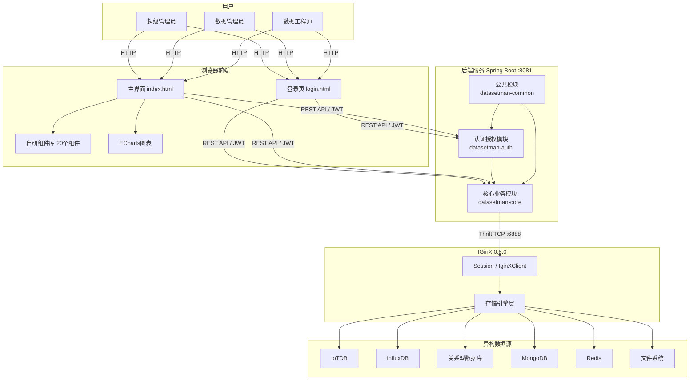
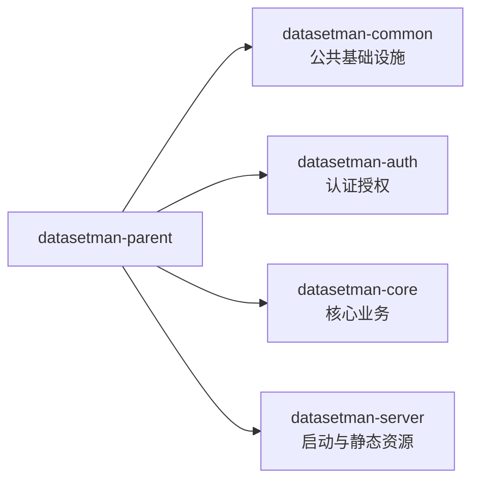
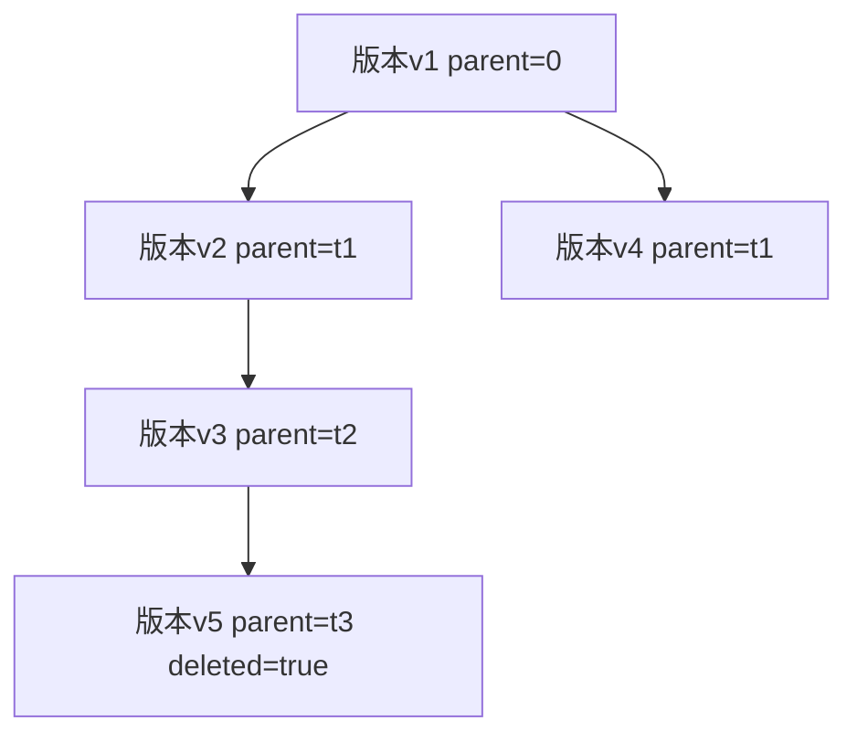
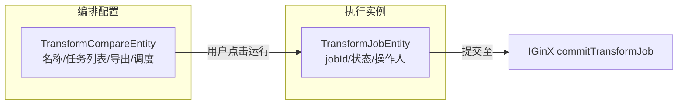
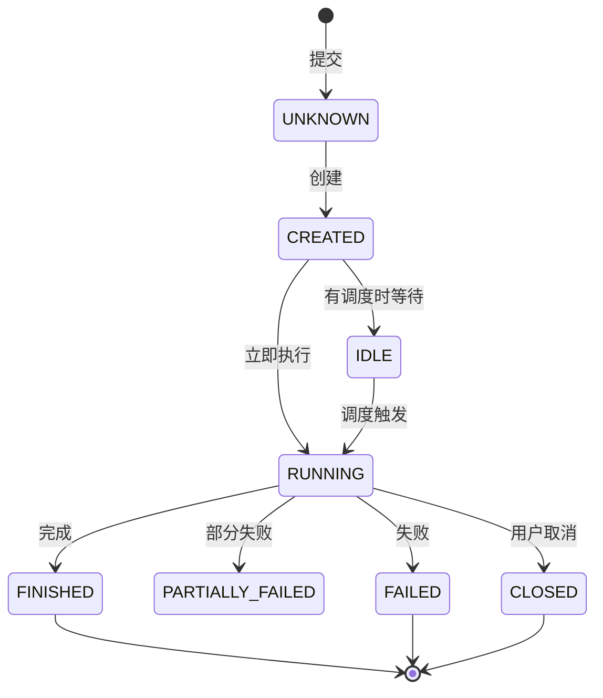
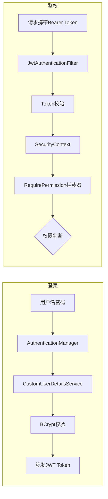
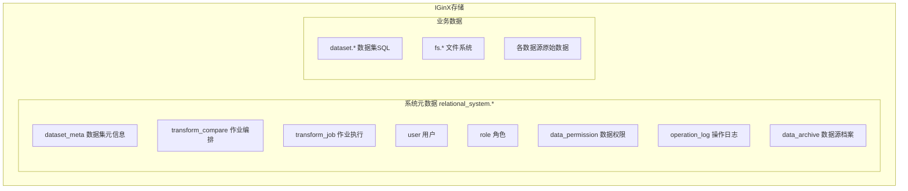
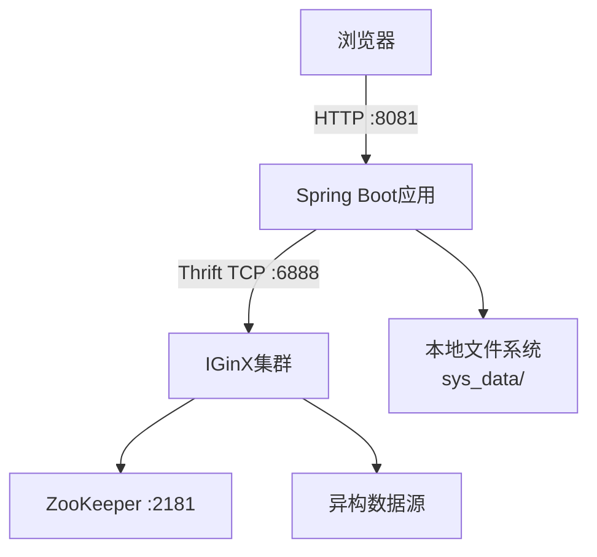

数据集管理软件

概要设计文档

清华大学 软件学院

大数据系统软件国家工程实验室

2026年04月

---

# 第1章 引言

## 1.1 编写目的

本文档为"数据集管理软件"的概要设计文档，从系统总体视角描述架构划分、模块职责、接口规划与数据存储策略，为详细设计及开发实施提供顶层指导。

## 1.2 系统定位

数据集管理软件是基于IGinX 0.8.0构建的上层Web应用，为数据管理员和数据工程师提供异构数据源接入、数据集定义与管理、Transform作业编排与执行、Python函数托管等一站式可视化操作能力。

## 1.3 术语说明

| 术语 | 说明 |
|---|---|
| IGinX | 清华数为·多源异构数据一体化管理分析系统 |
| Transform | 基于Python的数据处理流程 |
| UDF | 用户定义函数（UDAF/UDTF/UDSF） |
| JWT | JSON Web Token，无状态身份认证 |
| RBAC | 基于角色的访问控制 |

---

# 第2章 系统总体设计

## 2.1 总体架构

系统采用B/S架构，底层完全复用IGinX的存储与计算能力，不新增独立数据库，所有元数据通过IGinX Session接口以`relational_system.*`前缀写入。



## 2.2 技术选型

| 层次 | 技术 | 版本 |
|---|---|---|
| 前端 | HTML5 + CSS3 + ES6+ + ECharts | - |
| 后端 | Spring Boot + Spring Security | 2.7.18 |
| 认证 | JWT | - |
| 底层引擎 | IGinX | 0.8.0 |
| 通信 | Thrift | 0.22.0 |
| 构建 | Maven | - |
| 运行时 | JDK | 1.8+ |

## 2.3 模块划分



| 模块 | 职责 |
|---|---|
| datasetman-common | CORS配置、统一响应模型`Result<T>`、全局异常处理、工具类 |
| datasetman-auth | JWT认证、Spring Security配置、`@RequirePermission`权限拦截、`@OperationLog`AOP日志、用户/角色/权限DAO |
| datasetman-core | 数据源管理、数据查询、数据集管理、Transform作业编排与执行、函数管理 |
| datasetman-server | Spring Boot启动入口、`application.yml`配置、前端静态资源托管 |

---

# 第3章 功能模块概要设计

## 3.1 数据资源管理

### 职责

异构数据源的注册、移除、列表展示与资源树浏览，支持IoTDB、InfluxDB、PostgreSQL/MySQL/达梦、MongoDB、Redis、文件系统FS六类数据源。

### 核心类

| 类 | 职责 |
|---|---|
| `DataSourceController` | 注册/移除/列表/资源树 REST接口 |
| `DataSourceService` | 调用IGinX Session管理存储引擎，数据权限过滤 |
| `DataArchiveService` | 数据源档案元数据管理 |

### 关键流程

```mermaid
sequenceDiagram
    U: 数据管理员
    participant F as 前端
    participant C as DataSourceController
    participant S as DataSourceService
    participant I as IGinX

    U->>F: 选择数据源类型，填写连接参数
    F->>C: POST /api/datasource/register
    C->>S: registerDataSource(request)
    S->>S: 校验tablePrefix是否已存在
    S->>I: addStorageEngine(ip, port, type, extraParams)
    S->>I: 保存数据源档案元数据
    S-->>C: 成功
    C-->>F: Result.success
```

### 数据源类型映射

| type | 数据源 | 特有参数 |
|---|---|---|
| 1 | IoTDB | username, password |
| 2 | InfluxDB | username, password, database |
| 3 | 文件系统FS | dummyDir, isReadOnly |
| 4 | 关系型数据库 | username, password, databaseName |
| 5 | MongoDB | username, password |
| 6 | Redis | password |

## 3.2 数据查询与管理

### 职责

提供统一的数据查询窗口，支持时序数据、结构化数据、半结构化数据、键值数据、文件数据五类差异化检索与展示，支持大文件流式导入导出。

### 核心类

| 类 | 职责 |
|---|---|
| `DataTableController` | 数据查询/流式查询/导入/导出接口 |
| `DataTableService` | 调用IGinX执行查询，结果转换为`TableDto` |
| `RelationalDataService` | 关系型数据专用查询逻辑 |

### 数据类型展示策略

| 数据类型 | 展示方式 | 前端组件 |
|---|---|---|
| 时序数据 | ECharts趋势图 + 分页表格 | data-visualization |
| 结构化数据 | 二维表格（排序/筛选） | database-table |
| 半结构化数据 | JSON树形折叠 | semi-structured-viewer |
| 键值数据 | 单键聚焦详情 | key-value-viewer |
| 文件数据 | 智能预览（图片/音视频/文档） | file-system-browser |

## 3.3 数据集管理

### 职责

数据集的全生命周期管理：通过SQL定义数据集、版本化保存、逻辑删除、变更历史追溯与血缘图谱展示。

### 核心类

| 类 | 职责 |
|---|---|
| `DatasetController` | SQL测试/保存/查询/删除/版本历史接口 |
| `DatasetService` | SQL校验、版本生成、元数据写入IGinX、版本树构建 |

### 存储设计

- **`dataset.{name}.{version}`**：存储SQL定义（二进制）
- **`relational_system.dataset_meta`**：存储元信息（名称、版本、操作人、IP、parent、deleted）

### 版本管理

- 每次保存生成基于时间戳的唯一版本号
- `parent`字段关联父版本，根版本`parent=0`
- 删除为逻辑删除（`deleted=true`），保留完整历史
- 前端以树形结构展示版本演进



## 3.4 作业调度引擎

### 职责

Transform作业的可视化编排、提交执行、状态监控与取消，支持IGinX查询任务与Python Transform任务的链式编排。

### 核心类

| 类 | 职责 |
|---|---|
| `TransformCompareController` | 作业编排配置的CRUD |
| `TransformCompareService` | 编排配置存储与查询 |
| `TransformJobController` | 作业提交/状态/取消/血缘查询 |
| `TransformJobService` | 调用IGinX提交作业、查询状态、取消作业 |

### 编排与执行分离



### 任务类型

| 字段 | 可选值 | 说明 |
|---|---|---|
| taskType | IGINX / Python | IGinX查询 / Transform脚本 |
| dataFlowType | Stream / Batch | 流式 / 批式 |
| exportType | None(0) / IGinX(1) / File(2) | 输出目标 |

**约束**：每个作业至少包含一个task，且第一个task必须为IGinX查询任务。

### 作业状态流转



## 3.5 函数管理

### 职责

Transform脚本与UDF脚本的注册（上传.py + 注册到IGinX）、删除、查询、下载。

### 核心类

| 类 | 职责 |
|---|---|
| `FunctionController` | 注册/删除/查询/下载接口 |
| `FunctionService` | 文件存储管理、IGinX SQL注册/删除 |

### 文件存储结构

```
sys_data/function/
├── transform/    # Transform脚本
└── udf/          # UDF脚本
```

### 注册方式

| 类型 | IGinX SQL |
|---|---|
| Transform | `CREATE FUNCTION TRANSFORM "name" FROM "class" IN "path"` |
| UDF | `CREATE FUNCTION {udfType} "name" FROM "class" IN "path"` |

UDF支持三种子类型：UDAF（聚合）、UDTF（表值）、UDSF（标量）。

---

# 第4章 认证与安全设计

## 4.1 认证方案

采用Spring Security + JWT无状态认证，不使用Session。



## 4.2 权限控制

- **`@RequirePermission(Permission.XXX)`**：方法级权限注解，由拦截器校验
- **`@OperationLog(value, type)`**：AOP切面自动记录操作日志
- 权限按资源分组：数据源、数据、用户管理等，每组含CRUD四项

## 4.3 安全策略

| 策略 | 实现方式 |
|---|---|
| 密码加密 | BCryptPasswordEncoder |
| Token有效期 | Access 8h / Refresh 12h |
| SQL注入防护 | 关键字过滤 + 仅允许SELECT |
| 数据隔离 | 非管理员仅可见授权数据源 |
| 操作审计 | 全量操作日志（操作人/IP/参数/结果/耗时） |
| CORS | 允许所有源（生产环境按需收紧） |

---

# 第5章 接口设计概要

## 5.1 API分组

```mermaid
graph LR
    API[/api] --> A1[/auth 认证]
    API --> A2[/datasource 数据源]
    API --> A3[/data 数据查询]
    API --> A4[/dataset 数据集]
    API --> A5[/transform-compare 作业编排]
    API --> A6[/transform-job 作业执行]
    API --> A7[/function 函数管理]
```

## 5.2 接口清单

| 模块 | 接口数 | 核心接口 |
|---|---|---|
| 认证 | 2 | login, refresh |
| 数据源 | 4 | register, remove, list, tree |
| 数据查询 | 4 | query, fs/query, import, export |
| 数据集 | 5 | testsql, save, metas, delete, history |
| 作业编排 | 5 | save, query, count, detail, delete |
| 作业执行 | 7 | query, count, detail, commit, status, cancel, bloodline |
| 函数 | 5 | register/transform, register/udf, delete, list, download |

## 5.3 统一响应格式

```json
{
  "code": 200,
  "message": "success",
  "data": { ... }
}
```

状态码：200=成功，401=未认证，403=无权限，500=内部错误。

---

# 第6章 数据存储设计概要

## 6.1 存储架构

系统不使用独立数据库，所有元数据通过IGinX Session接口存储。



## 6.2 核心实体概要

| 实体 | 存储路径 | 核心字段 |
|---|---|---|
| DatasetEntity | relational_system.dataset_meta | datasetName, datasetSql, version, parent, deleted |
| TransformCompareEntity | relational_system.transform_compare | name, taskList, exportType, schedule |
| TransformJobEntity | relational_system.transform_job | jobId, jobState, taskList, owner |
| UserEntity | relational_system.user | username, password(BCrypt), role, enabled |
| OperationLogEntity | relational_system.operation_log | operator, description, type, status, executionTime |

## 6.3 文件系统存储

```
sys_data/
├── function/
│   ├── transform/    # Transform .py脚本
│   └── udf/          # UDF .py脚本
└── job/              # Transform作业输出文件
```

---

# 第7章 前端设计概要

## 7.1 前端架构

纯HTML5 + JavaScript + CSS3，无框架依赖，自研组件库。

| 层次 | 内容 |
|---|---|
| 页面 | login.html, index.html |
| 核心JS | main.js(108KB), desktop-shell.js, common-utils.js, modal-manager.js, menu-permission.js |
| 组件库 | 20个组件（data-resource, dataset-dialog, transform-compare, transform-job, udf-management等） |
| 第三方库 | ECharts等 |

## 7.2 界面布局

| 布局类型 | 适用模块 | 描述 |
|---|---|---|
| 左右树三分区 | 数据资源管理、数据集管理 | 左15%资源树 + 中70%详情 + 右15%数据集树 |
| 卡片/画布 | 作业调度引擎 | 卡片式任务编排，支持拖拽排序 |
| 关系图谱 | 数据集历史 | ECharts Dashboard，DAG血缘图 |

## 7.3 前端权限控制

登录后获取用户角色与权限，动态渲染菜单项与按钮可见性。

---

# 第8章 部署设计概要

## 8.1 部署架构



## 8.2 关键配置

| 配置 | 值 |
|---|---|
| 服务端口 | 8081 |
| IGinX地址 | 127.0.0.1:6888 |
| JWT有效期 | 8h / Refresh 12h |
| 最大文件上传 | 2GB |
| 离线模式 | 启用 |

## 8.3 运行环境

| 项目 | 要求 |
|---|---|
| 操作系统 | Windows / 国产OS |
| JDK | 1.8+ |
| ZooKeeper | 3.7.2+ |
| IGinX | 0.8.0 |
| 浏览器 | Chrome 80+, Edge, Firefox |
| CPU | 单核2.0GHz+ |
| 内存 | 4GB+ |
| 硬盘 | 1PB+ |

## 8.4 离线部署

- 前端资源打包在`static/`目录
- Maven离线仓库管理依赖
- 不依赖外部网络资源

---

# 第9章 非功能性设计概要

| 维度 | 设计要点 |
|---|---|
| 性能 | 日常操作<10s，复杂操作<20s，支持100并发 |
| 可靠性 | 7×24运行，IGinX底层容错，全量操作日志 |
| 安全性 | JWT认证 + BCrypt加密 + RBAC权限 + SQL注入防护 + 数据隔离 |
| 可维护性 | 模块化架构，版本化管理，统一日志，Swagger文档 |
| 可移植性 | 完全离线部署，兼容Windows及国产OS，纯Java+HTML无平台依赖 |
