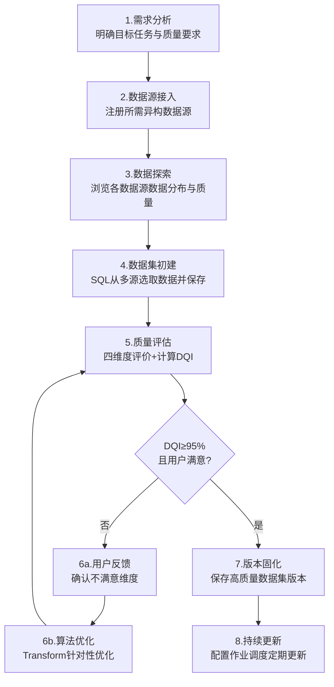

数据集管理软件

用户手册

清华大学 软件学院

大数据系统软件国家工程实验室

2026年04月

---

# 第1章 系统概述

## 1.1 软件简介

数据集管理软件是一款基于IGinX异构数据一体化管理分析系统构建的Web应用平台，为用户提供异构数据源接入、数据集定义与管理、Transform作业编排与执行、Python函数托管、质量评价等一站式可视化操作能力。系统作为多元数据集管理工具，支持接入IoTDB、InfluxDB、PostgreSQL、MySQL、Oracle、达梦数据库、OceanBase、MongoDB、Redis、文件系统FS等不少于10个异构数据源，覆盖结构化数据、时序数据、半结构化文档、文本、图像、音频、视频等不少于七种典型数据类型，数据总量达1PB以上。系统建立完整性、一致性、时效性、有效性四个维度的高质量数据集评价准则，通过Transform作业执行质量评价算法脚本，计算DQI综合质量指标（不低于95%），支撑基于用户反馈的迭代闭环高质量数据集构建流程。

## 1.2 适用读者

| 角色 | 职责 | 典型操作 |
|---|---|---|
| 超级管理员 | 系统全局管理 | 用户管理、权限分配、数据源管理 |
| 数据管理员 | 数据资源维护 | 注册/移除数据源、数据导入导出、数据查询 |
| 数据工程师 | 数据加工处理 | 创建数据集、编排Transform作业、注册函数、质量评价 |

## 1.3 运行环境

- **浏览器**：Chrome 80+、Edge、Firefox
- **分辨率**：推荐1920×1080，兼容1366×768
- **网络**：需能访问应用服务器（默认端口8081）

---

# 第2章 登录与登出

## 2.1 登录

1. 打开浏览器，在地址栏输入应用服务器地址，例如 `http://localhost:8081`
2. 系统自动跳转至登录页面
3. 输入**用户名**和**密码**
4. 点击"登录"按钮或按**Enter**键


> **说明**：登录成功后系统自动跳转至主页面。Token有效期为8小时，刷新Token有效期为12小时，超时后需重新登录。

## 2.2 登出

点击主页面右上角的**登出图标**，系统将清除本地Token并跳转回登录页面。

## 2.3 修改密码

1. 点击顶部导航栏右侧用户名旁的**用户头像图标**，或通过菜单 **用户 → 修改密码**
2. 在弹窗中输入旧密码、新密码、确认新密码
3. 点击"确认"完成修改

---

# 第3章 主界面布局

主界面采用**顶部导航 + 功能按钮栏 + 左中右三栏**的桌面式布局。

## 3.1 界面区域说明

```
┌─────────────────────────────────────────────────────┐
│  顶部导航栏（主页/数据源/数据集/作业/函数/用户/工具/设置/帮助） │
├─────────────────────────────────────────────────────┤
│  功能按钮栏（新增/管理/创建/删除/编辑/编排/任务/Transform/UDF）│
├──────────┬───────────────────────┬──────────────────┤
│          │                       │                  │
│  左侧栏   │      中间工作区          │    右侧栏         │
│  数据资源库 │   （组件展示与操作区域）    │   数据集库        │
│  (15%)   │       (70%)           │    (15%)         │
│          │                       │                  │
├──────────┴───────────────────────┴──────────────────┤
│  底部边栏图标（左侧数据资源库 / 右侧数据集库）              │
└─────────────────────────────────────────────────────┘
```

## 3.2 顶部导航菜单

| 菜单 | 子菜单 | 功能说明 |
|---|---|---|
| **主页** | - | 返回主工作区 |
| **数据源** | 数据源管理 | 查看已注册数据源列表 |
| | 注册异构数据源 | 打开数据源注册面板 |
| **数据集** | 创建数据集 | 打开数据集创建弹窗 |
| | 删除数据集 | 删除选中的数据集 |
| | 编辑数据集 | 编辑选中的数据集 |
| **作业** | 编排Transform作业 | 打开作业编排界面 |
| | Transform任务管理 | 打开任务执行管理界面 |
| **函数** | Transform托管 | 管理Transform脚本 |
| | UDF托管 | 管理UDF脚本 |
| **质量评价** | 评价准则 | 配置质量维度权重与Transform编排绑定 |
| | 质量测评 | 查看测评记录、录入得分、计算DQI |
| **用户** | 用户管理 | 管理系统用户（仅管理员可见） |
| | 权限管理 | 管理角色与数据权限（仅管理员可见） |
| | 修改密码 | 修改当前用户密码 |
| **工具** | 窗口 → 左侧边栏 | 显示/隐藏左侧栏 |
| | 窗口 → 右侧边栏 | 显示/隐藏右侧栏 |
| | 清空工作区 | 清空中间工作区所有组件 |
| **设置** | 菜单字体 → 小/中/大/特大 | 调整菜单字体大小 |
| | 主题 → 明亮模式/暗黑模式 | 切换界面主题 |
| **帮助** | 用户手册 | 查看本手册 |
| | 关于 | 查看软件版本信息 |

## 3.3 功能按钮栏

按钮栏按功能分为四组，提供快捷操作：

| 按钮组 | 按钮 | 功能 |
|---|---|---|
| 数据源管理 | 新增 | 打开数据源注册面板 |
| | 管理 | 打开数据源列表 |
| 数据集管理 | 创建 | 打开数据集创建弹窗 |
| | 删除 | 删除选中数据集 |
| | 编辑 | 编辑选中数据集 |
| 作业调度引擎 | 编排 | 打开Transform作业编排 |
| | 任务 | 打开Transform任务管理 |
| 函数管理 | Transform | 打开Transform函数管理 |
| | UDF | 打开UDF函数管理 |
| 质量评价 | 评价准则 | 打开评价准则管理 |
| | 质量测评 | 打开质量测评记录 |

## 3.4 左侧栏 — 数据资源库

展示已注册的异构数据源树形结构，支持展开/折叠。顶部提供**数据视图切换下拉框**，可手动切换以下视图模式：

| 视图模式 | 适用数据类型 |
|---|---|
| 时序数据视图 | IoTDB、InfluxDB等时序数据 |
| 文件数据视图 | 文件系统FS中的文件（文本、图像、音频、视频） |
| 关系数据视图 | PostgreSQL、MySQL、Oracle、达梦、OceanBase等关系型数据 |
| 半结构化数据视图 | MongoDB等半结构化文档数据 |
| 键值数据视图 | Redis等键值数据 |

点击树节点后，中间工作区将根据数据类型自动加载对应的展示组件。

## 3.5 右侧栏 — 数据集库

展示已创建的数据集树形结构，支持展开/折叠。点击数据集节点可查看详情或进行编辑/删除操作。

---

# 第4章 数据源管理

## 4.1 注册异构数据源

### 操作步骤

1. 通过以下任一方式打开注册面板：
   - 点击功能按钮栏 **数据源管理 → 新增**
   - 菜单 **数据源 → 注册异构数据源**
2. 在注册面板中填写以下信息：

| 字段 | 说明 | 示例 |
|---|---|---|
| 数据源类型 | 选择要接入的数据源类型 | IoTDB / InfluxDB / PostgreSQL / MySQL / Oracle / 达梦数据库 / OceanBase / MongoDB / Redis / 文件系统 |
| 数据源别名 | 自定义名称，用于标识 | "生产环境IoTDB" |
| IP地址 | 数据源服务器IP | 192.168.1.100 |
| 端口 | 数据源服务端口 | 6688 |
| Schema前缀 | 数据在IGinX中的命名空间前缀 | iotdb_prod |
| Data前缀 | 数据路径前缀（可选） | device01 |
| 描述 | 数据源描述信息（可选） | 生产环境时序数据库 |

3. 根据数据源类型，还需填写类型特有参数：

| 数据源类型 | 特有参数 |
|---|---|
| IoTDB | 用户名、密码 |
| InfluxDB | 用户名、密码、数据库名 |
| PostgreSQL | 用户名、密码、数据库名 |
| MySQL | 用户名、密码、数据库名 |
| Oracle | 用户名、密码、数据库名/SID |
| 达梦数据库 | 用户名、密码、数据库名 |
| OceanBase | 用户名、密码、数据库名 |
| MongoDB | 用户名、密码 |
| Redis | 密码 |
| 文件系统 | 文件目录路径、是否只读 |

4. 点击"注册"按钮完成注册

> **注意**：Schema前缀和数据前缀组合后不能与已注册的数据源重复，否则系统将提示"数据资源已存在"。

## 4.2 管理数据源

### 查看数据源列表

1. 点击功能按钮栏 **数据源管理 → 管理**，或菜单 **数据源 → 数据源管理**
2. 工作区显示已注册数据源列表，包含ID、IP、端口、类型、Schema前缀、Data前缀等信息

### 移除数据源

1. 在数据源列表中选中要移除的数据源
2. 点击"卸载"按钮
3. 在确认对话框中点击"确定"

> **警告**：移除数据源将同时删除该数据源的数据权限配置和档案元数据，请谨慎操作。

---

# 第5章 数据查询与浏览

## 5.1 浏览数据资源树

1. 在左侧栏"数据资源库"中展开数据源节点
2. 系统显示 `数据源 → Schema/Group → 表/Measurement` 三级树结构
3. 点击叶子节点（表或Measurement），中间工作区自动加载对应数据视图

## 5.2 时序数据查询

选中时序数据节点后，工作区加载**数据可视化组件**：

- **图表展示**：使用ECharts渲染时序趋势折线图
- **时间范围**：可设置查询的起止时间范围
- **聚合查询**：支持按时间粒度聚合（如按分钟/小时/天聚合）
- **分页表格**：图表下方显示原始数据表格，支持分页浏览

## 5.3 关系型数据查询

选中关系型数据节点后，工作区加载**数据库表格组件**：

- 以二维表格形式展示查询结果
- 支持列排序
- 支持分页浏览

## 5.4 半结构化数据查询

选中MongoDB等半结构化数据节点后，工作区加载**半结构化查看器**：

- 以JSON树形折叠方式展示文档结构
- 支持层级展开/折叠

## 5.5 键值数据查询

选中Redis等键值数据节点后，工作区加载**键值查看器**：

- 单键聚焦详情面板
- 显示Key对应的Value内容及数据类型

## 5.6 文件数据浏览

选中文件系统节点后，工作区加载**文件系统浏览器**：

- 以目录树形式展示文件结构
- 支持按文件类型智能预览：
  - **图片**（jpg/png/gif等）：直接内联预览
  - **音频**（mp3/wav等）：内置播放器
  - **视频**（mp4/avi等）：内置播放器
  - **文档**（docx等）：文档预览
  - **其他**：显示文件信息和下载链接

## 5.7 数据导入

1. 在左侧栏选中目标数据路径
2. 通过菜单或按钮触发导入功能
3. 选择要导入的文件（支持最大2GB）
4. 配置导入参数（数据类型、是否有表头等）
5. 点击"开始导入"

## 5.8 数据导出

1. 选中要导出的数据节点
2. 触发导出功能
3. 系统以流式方式将数据导出为文件，浏览器自动下载

---

# 第6章 数据集管理

## 6.1 创建数据集

### 操作步骤

1. 通过以下任一方式打开创建弹窗：
   - 点击功能按钮栏 **数据集管理 → 创建**
   - 菜单 **数据集 → 创建数据集**
2. 在弹窗中填写信息：

| 字段 | 说明 |
|---|---|
| 数据集名称 | 自定义名称，用于在数据集库中标识 |
| SQL语句 | 编写IGinX SQL查询语句，从数据源中选取数据 |
| 备注 | 数据集描述信息（可选） |

3. 编写SQL后，点击"测试"按钮验证SQL正确性
   - 系统执行SQL并返回查询结果预览
   - 仅允许SELECT语句，禁止DELETE/UPDATE/INSERT/DROP/ALTER/TRUNCATE等危险操作
4. 测试通过后，点击"保存"按钮

> **说明**：每次保存自动生成新版本号，保留完整变更历史。

## 6.2 编辑数据集

1. 在右侧栏"数据集库"中选中要编辑的数据集
2. 点击功能按钮栏 **数据集管理 → 编辑**，或菜单 **数据集 → 编辑数据集**
3. 在弹窗中修改SQL语句或备注
4. 点击"测试"验证修改后的SQL
5. 点击"保存"完成编辑

> **说明**：编辑操作会生成新版本，原版本保留在历史记录中。

## 6.3 删除数据集

1. 在右侧栏"数据集库"中选中要删除的数据集
2. 点击功能按钮栏 **数据集管理 → 删除**，或菜单 **数据集 → 删除数据集**
3. 在确认对话框中点击"确定"

> **说明**：删除为逻辑删除，数据集标记为已删除状态（显示为灰色），历史记录中仍保留该版本信息。

## 6.4 查看版本历史

1. 在右侧栏选中数据集后，工作区加载**数据集历史组件**
2. 以树形结构展示该数据集的所有版本，包含：
   - 版本号
   - 创建时间
   - 操作人
   - 操作人IP
   - SQL语句
   - 备注
   - 删除状态（已删除版本显示灰色）
3. 点击版本节点可查看该版本的详细信息

## 6.5 血缘图谱

1. 在数据集历史界面中查看血缘关系
2. 系统以DAG（有向无环图）形式展示数据集与Transform作业之间的血缘关系
3. 可选择是否显示旁系血缘（同一作业的多次执行记录）

---

# 第7章 作业调度引擎

## 7.1 编排Transform作业

### 操作步骤

1. 通过以下任一方式打开编排界面：
   - 点击功能按钮栏 **作业调度引擎 → 编排**
   - 菜单 **作业 → 编排Transform作业**
2. 在编排界面中配置作业：

| 配置项 | 说明 |
|---|---|
| 作业名称 | 自定义名称，不可与已有作业重名 |
| 任务列表 | 添加一个或多个任务，按顺序执行 |
| 导出方式 | 不导出 / 写回IGinX / 写入文件 |
| 导出文件路径 | 选择"写入文件"时指定输出文件路径 |
| 调度表达式 | Cron表达式，用于定时执行（可选） |

3. 添加任务：每个任务需配置以下信息：

| 字段 | 说明 |
|---|---|
| 任务类型 | **IGinX**（查询数据集）或 **Python**（执行Transform脚本） |
| 数据流动方式 | **Stream**（流式）或 **Batch**（批式） |
| 数据集 | 任务类型为IGinX时，选择已创建的数据集 |
| Python函数 | 任务类型为Python时，选择已注册的Transform函数 |
| 超时时间 | 任务执行超时时间（毫秒） |

4. 通过拖拽或序号调整任务执行顺序

> **约束**：每个作业至少包含一个任务，且第一个任务必须为IGinX查询任务。

5. 点击"保存"完成编排

### 编辑已有作业

在编排界面的作业列表中选中已有作业，可查看并修改配置后重新保存。

## 7.2 Transform任务管理

### 查看任务列表

1. 点击功能按钮栏 **作业调度引擎 → 任务**，或菜单 **作业 → Transform任务管理**
2. 工作区显示任务执行列表，包含：
   - 作业名称
   - 任务列表
   - 导出方式
   - 调度表达式
   - 作业状态
   - 创建时间
   - 操作人
3. 支持按作业名称和状态筛选
4. 支持分页浏览

### 提交作业执行

1. 在编排作业列表中找到要执行的作业
2. 点击"运行"按钮
3. 系统将编排配置提交至IGinX执行，生成执行实例

### 查看作业状态

1. 在任务管理列表中找到目标作业
2. 点击"刷新"按钮更新状态

作业状态说明：

| 状态 | 说明 |
|---|---|
| 未知 | 作业刚提交，状态尚未确定 |
| 已完成 | 作业执行完成 |
| 已创建 | 作业已创建，等待执行 |
| 等待运行 | 有调度配置，等待调度触发 |
| 运行中 | 作业正在执行 |
| 部分失败 | 作业部分任务失败 |
| 失败 | 作业执行失败 |
| 取消中 | 正在取消作业 |
| 已取消 | 作业已被取消 |

### 取消作业

1. 在任务管理列表中找到运行中的作业
2. 点击"取消"按钮
3. 系统向IGinX发送取消指令

### 查看作业详情

点击作业列表中的"详情"按钮，查看作业的完整配置和执行信息。

### 删除作业

1. 在任务管理列表中选中要删除的作业
2. 点击"删除"按钮
3. 在确认对话框中点击"确定"

---

# 第8章 函数管理

## 8.1 Transform托管

### 注册Transform函数

1. 点击功能按钮栏 **函数管理 → Transform**，或菜单 **函数 → Transform托管**
2. 工作区显示已注册的Transform函数列表
3. 点击"注册"按钮
4. 在弹窗中填写：

| 字段 | 说明 |
|---|---|
| 函数别名 | 自定义名称，用于在编排时选择 |
| 类名 | Python脚本中的类名 |
| 脚本文件 | 上传.py文件 |

5. 点击"确认"完成注册

> **说明**：系统将脚本文件保存到本地 `sys_data/function/transform/` 目录，并通过IGinX SQL注册到集群。

### 删除Transform函数

1. 在函数列表中选中要删除的函数
2. 点击"删除"按钮
3. 在确认对话框中点击"确定"

> **警告**：删除操作将物理删除脚本文件并从IGinX注销函数，不可恢复。

### 下载Transform函数

1. 在函数列表中点击"下载"按钮
2. 浏览器自动下载对应的.py脚本文件

## 8.2 UDF托管

### 注册UDF函数

1. 点击功能按钮栏 **函数管理 → UDF**，或菜单 **函数 → UDF托管**
2. 工作区显示已注册的UDF函数列表
3. 点击"注册"按钮
4. 在弹窗中填写：

| 字段 | 说明 |
|---|---|
| 函数别名 | 自定义名称 |
| 函数类型 | UDAF（聚合函数）/ UDTF（表值函数）/ UDSF（标量函数） |
| 类名 | Python脚本中的类名 |
| 脚本文件 | 上传.py文件 |

5. 点击"确认"完成注册

### UDF类型说明

| 类型 | 全称 | 说明 |
|---|---|---|
| UDAF | User-Defined Aggregation Function | 聚合函数，对多行数据计算返回单个值 |
| UDTF | User-Defined Table-Function | 表值函数，返回多行多列结果集 |
| UDSF | User-Defined Scalar Function | 标量函数，输入一行返回一个值 |

### 删除与下载UDF

操作方式与Transform函数相同，参考8.1节相关说明。

---

# 第9章 质量评价

质量评价模块用于对数据集进行多维度质量评估，计算DQI综合质量得分。模块分为**评价准则**和**质量测评**两个子功能，入口位于顶部导航栏"质量评价"菜单或功能按钮栏。

质量评价复用现有Transform作业调度引擎基础设施：每个质量维度（完整性、一致性、时效性、有效性）绑定一条Transform编排记录，测评时系统自动提交4个Transform作业执行质量评价算法脚本，作业完成后工程师录入各维度得分，系统按准则权重自动计算DQI。

## 9.1 评价准则

### 查看评价准则列表

1. 通过以下任一方式打开：
   - 点击功能按钮栏 **质量评价 → 评价准则**
   - 菜单 **质量评价 → 评价准则**
2. 工作区显示已创建的评价准则列表，包含：准则名称、描述、各维度绑定的Transform编排名称
3. 支持按准则名称筛选，支持分页浏览

### 新增评价准则

1. 点击"新增"按钮，打开评价准则编辑弹窗
2. 填写以下信息：

| 字段 | 说明 |
|---|---|
| 准则名称 | 自定义名称，用于标识评价准则 |
| 描述 | 准则描述信息（可选） |
| 完整性权重（w1） | 完整性维度权重，默认0.3 |
| 一致性权重（w2） | 一致性维度权重，默认0.2 |
| 时效性权重（w3） | 时效性维度权重，默认0.2 |
| 有效性权重（w4） | 有效性维度权重，默认0.3 |
| 完整性编排 | 选择完整性维度绑定的Transform编排 |
| 一致性编排 | 选择一致性维度绑定的Transform编排 |
| 时效性编排 | 选择时效性维度绑定的Transform编排 |
| 有效性编排 | 选择有效性维度绑定的Transform编排 |

3. 系统实时显示权重合计值，**权重之和必须等于1.0**
4. 每个维度必须绑定一个Transform编排
5. 点击"保存"完成创建

> **说明**：Transform编排需提前在"作业调度引擎"中创建（参考第7章），编排中包含IGinX查询任务和Python质量评价脚本任务。

### 编辑评价准则

1. 在评价准则列表中点击"编辑"按钮
2. 在弹窗中修改权重或重新绑定Transform编排
3. 点击"保存"完成编辑

### 删除评价准则

1. 在评价准则列表中点击"删除"按钮
2. 在确认对话框中点击"确定"

### 提交测评

1. 在评价准则列表中点击"提交测评"按钮
2. 系统弹出确认对话框，显示准则名称
3. 点击"确认提交"
4. 系统自动向4个维度绑定的Transform编排提交作业，并生成质量测评记录

> **说明**：提交后可在"质量测评"中查看作业状态和录入得分。

### 管理测评记录

1. 在评价准则列表中点击"管理"按钮
2. 系统自动跳转至"质量测评"页面，并筛选显示该准则对应的测评记录

## 9.2 质量测评

### 查看测评记录列表

1. 通过以下任一方式打开：
   - 点击功能按钮栏 **质量评价 → 质量测评**
   - 菜单 **质量评价 → 质量测评**
   - 在评价准则列表中点击"管理"按钮跳转
2. 工作区显示测评记录列表，包含：准则名称、创建时间、各维度得分、DQI综合得分
3. 支持按准则名称筛选，支持分页浏览

### 查看测评详情与录入得分

1. 在测评记录列表中点击"综合质量得分"按钮，进入详情页面
2. 详情页面展示以下信息：

| 区域 | 说明 |
|---|---|
| 准则信息区 | 显示准则名称和描述 |
| 维度任务区 | 展示4个维度的Transform作业信息：jobId、作业名称、导出文件名、权重、作业状态 |
| 得分录入区 | 每个维度提供得分输入框（0-100），录入后系统实时计算DQI |
| DQI展示区 | 显示DQI综合得分和质量达标状态（通过/未通过） |

3. 点击"查询状态"按钮，系统实时查询4个Transform作业的执行状态

作业状态说明：

| 状态 | 说明 |
|---|---|
| 未知 | 作业刚提交，状态尚未确定 |
| 完成 | 作业执行完成 |
| 创建 | 作业已创建，等待执行 |
| 等待运行 | 有调度配置，等待调度触发 |
| 运行中 | 作业正在执行 |
| 部分失败 | 作业部分任务失败 |
| 失败 | 作业执行失败 |
| 取消中 | 正在取消作业 |
| 取消 | 作业已被取消 |

4. 待作业完成后，根据Transform脚本输出的评价结果，在各维度得分输入框中录入得分（0-100）
5. 系统自动按公式 `DQI = w1 * Qcom + w2 * Qcon + w3 * Qtim + w4 * Qval` 计算综合得分
6. 点击"保存"保存得分和DQI结果

### 质量达标判定

系统按以下条件判定质量是否达标：

- 各维度得分（Qcom、Qcon、Qtim、Qval）均 ≥ 95
- DQI综合得分 ≥ 95

满足以上条件则显示"通过"，否则显示"未通过"。

> **说明**：若某维度得分不达标，建议在"作业调度引擎"中编排新的Transform作业进行针对性优化（如补全缺失字段、统一编码格式等），然后重新提交测评。

---

# 第10章 用户管理（管理员功能）

> **注意**：用户管理和权限管理仅对超级管理员（ADMIN角色）可见。

## 10.1 用户管理

### 查看用户列表

菜单 **用户 → 用户管理**，工作区显示所有系统用户，包含用户名、角色、启用状态等信息。

### 新增用户

1. 点击"新增"按钮
2. 填写用户名、密码、角色
3. 点击"保存"

### 编辑用户

1. 选中用户，点击"编辑"
2. 修改角色或启用状态
3. 点击"保存"

### 删除用户

1. 选中用户，点击"删除"
2. 在确认对话框中点击"确定"

## 10.2 权限管理

### 角色管理

菜单 **用户 → 权限管理**，可查看和配置角色对应的权限项。

### 数据权限配置

管理员可为用户分配可访问的数据源（tablePrefix），非管理员用户仅能查看和操作其被授权的数据源。

---

# 第11章 系统设置

## 11.1 主题切换

- 菜单 **设置 → 主题 → 明亮模式**：切换至浅色主题
- 菜单 **设置 → 主题 → 暗黑模式**：切换至深色主题
- 也可点击顶部导航栏右侧的**主题图标**快速切换

## 11.2 字体大小

菜单 **设置 → 菜单字体**，可选择：小、中、大、特大。

## 11.3 窗口管理

- **显示/隐藏左侧栏**：菜单 **工具 → 窗口 → 左侧边栏**，或点击底部边栏左侧图标
- **显示/隐藏右侧栏**：菜单 **工具 → 窗口 → 右侧边栏**，或点击底部边栏右侧图标
- **清空工作区**：菜单 **工具 → 清空工作区**，关闭中间工作区所有打开的组件

---

# 第12章 典型操作流程

## 12.1 从数据源到Transform执行完整流程

以下是数据工程师从接入数据源到执行Transform作业的完整操作流程：

```
步骤1: 注册数据源
  → 数据源管理 → 新增 → 选择类型 → 填写连接参数 → 注册

步骤2: 浏览数据
  → 左侧栏展开数据源树 → 选择数据表 → 查看数据

步骤3: 创建数据集
  → 数据集管理 → 创建 → 编写SQL → 测试 → 保存

步骤4: 注册Transform函数（如需）
  → 函数管理 → Transform → 注册 → 上传.py脚本

步骤5: 编排Transform作业
  → 作业调度引擎 → 编排 → 添加任务 → 配置数据集和函数 → 保存

步骤6: 执行作业
  → 作业调度引擎 → 任务 → 选中作业 → 运行

步骤7: 查看结果
  → 刷新作业状态 → 查看详情 → 查看血缘图谱

步骤8: 质量评价准则配置
  → 质量评价 → 评价准则 → 新增
  → 配置4个维度权重（w1~w4，合计=1.0）
  → 为每个维度绑定Transform编排（含质量评价Python脚本）
  → 保存准则 → 点击"提交测评"

步骤9: 质量测评与得分录入
  → 质量评价 → 质量测评 → 查看测评记录
  → 点击"综合质量得分" → 查询作业状态
  → 待作业完成后录入各维度得分（0-100）
  → 系统自动计算DQI → 保存

步骤10: 迭代优化（如DQI<95%或用户不满意）
  → 用户反馈不满意维度 → 编排Transform作业针对性优化 → 重新提交测评
  → 重复直至DQI≥95%且用户满意

步骤11: 版本固化与持续更新
  → 保存高质量数据集版本 → 配置作业调度定期更新
```

## 12.2 数据集版本追溯流程

```
步骤1: 在右侧栏选中数据集
  → 工作区显示数据集历史组件

步骤2: 查看版本树
  → 展开各版本节点，查看操作人、时间、SQL

步骤3: 查看血缘图谱
  → 点击"历史图谱" → ECharts渲染DAG血缘图
  → 可选择是否显示旁系血缘
```

---

# 第13章 典型应用场景：工业物联网多源数据统一管理与高质量数据集构建

## 13.1 场景概述

本场景以工业物联网环境为背景，验证系统对多元数据的统一管理能力及高质量数据集构建功能。场景涉及以下数据源与数据类型：

| 数据类型 | 数据源 | 示例数据 |
|---|---|---|
| 时序数据 | IoTDB、InfluxDB | 传感器温度、压力、振动等实时采集数据 |
| 结构化数据 | PostgreSQL、MySQL、Oracle、达梦、OceanBase | 设备台账、工单记录、物料信息 |
| 半结构化文档 | MongoDB | 故障报告、巡检日志 |
| 键值数据 | Redis | 设备状态缓存、实时告警标记 |
| 文本数据 | 文件系统FS | 操作规程、维修记录文本 |
| 图像数据 | 文件系统FS | 设备外观照片、巡检图片 |
| 音视频数据 | 文件系统FS | 故障录音、操作视频 |

数据总量达1PB以上，涉及七种典型数据类型，接入不少于10个异构数据源。

## 13.2 操作流程

1. **数据源接入**：注册IoTDB、InfluxDB、PostgreSQL、MySQL、Oracle、达梦数据库、OceanBase、MongoDB、Redis、文件系统FS等10个以上异构数据源。
2. **数据浏览**：在左侧栏展开各数据源，切换不同视图模式浏览七种数据类型。
3. **数据集创建**：编写IGinX-SQL从多个数据源选取数据，构建面向特定任务需求的初始数据集。
4. **质量评价准则配置**：在"质量评价 → 评价准则"中创建评价准则，配置4个维度权重并为每个维度绑定含质量评价Python脚本的Transform编排。
5. **质量测评**：点击"提交测评"触发4个Transform作业执行，在"质量测评"中查看作业状态、录入各维度得分，系统自动计算DQI综合质量得分。
6. **作业编排与执行**：编排Transform作业对数据集进行清洗、转换、聚合等加工处理。
7. **结果验证**：查看作业执行结果，通过血缘图谱追溯数据流转路径。

---

# 第14章 高质量数据集评价准则与构建流程

## 14.1 评价准则

基于用户反馈，系统建立以下四个维度的高质量数据集评价准则。该指标属于综合质量测评类指标，核心考核系统对经治理后的多模态工业数据在完整性、一致性、时效性、有效性4个维度上的质量达成情况。

### 14.1.1 完整性（Completeness，Qcom）

评价数据集中必填字段、关键记录、关联元数据是否齐备，确保数据对象和业务过程描述不存在关键内容缺失。

| 评价维度 | 说明 | 评价方式 |
|---|---|---|
| 字段完整性 | 数据集中必要字段是否存在缺失值 | Transform作业执行Python脚本统计缺失值比例 |
| 记录完整性 | 数据集是否覆盖所需时间范围或业务范围内的全部记录 | Transform作业执行Python脚本统计记录覆盖率 |
| 来源完整性 | 数据集是否整合了所有相关数据源的数据 | Transform作业检查数据集SQL涉及的数据源列表 |

### 14.1.2 一致性（Consistency，Qcon）

评价同一对象在不同来源、不同表结构和不同时间片中的字段含义、编码、单位及关联关系是否一致。

| 评价维度 | 说明 | 评价方式 |
|---|---|---|
| 格式一致性 | 相同字段在不同记录中的数据格式是否统一 | Transform作业执行Python脚本检查格式分布 |
| 值域一致性 | 相同字段的值是否在预期范围内 | Transform作业执行Python脚本过滤异常值 |
| 关联一致性 | 跨数据源关联字段的数据是否对应一致 | Transform作业执行Python脚本进行跨源比对校验 |

### 14.1.3 时效性（Timeliness，Qtim）

评价采集时间、入库时间、更新周期和业务有效期是否满足场景要求。

| 评价维度 | 说明 | 评价方式 |
|---|---|---|
| 数据新鲜度 | 数据集中最新数据的时间戳与当前时间的差距 | Transform作业执行Python脚本查询MAX(timestamp) |
| 更新频率 | 数据集是否按预期周期更新 | 查看作业调度表达式配置 |
| 版本时效性 | 数据集版本是否为最新有效版本 | 通过版本历史查看最新版本 |

### 14.1.4 有效性（Validity，Qval）

评价字段格式、取值范围、枚举编码、数据类型和业务约束是否符合规则。

| 评价维度 | 说明 | 评价方式 |
|---|---|---|
| 任务适配性 | 数据集字段和结构是否满足目标任务需求 | 用户反馈确认 |
| 数据准确性 | 数据值是否准确反映真实业务状态 | Transform作业执行Python脚本进行异常值检测 |
| 去重与清洗 | 数据集是否经过去重、异常值剔除等清洗处理 | Transform作业执行Python脚本执行清洗逻辑 |

### 14.1.5 数据质量综合指标（DQI）

数据质量综合指标DQI用于汇总反映上述4个维度的综合质量水平，其定义如下：

```
DQI = w1 * Qcom + w2 * Qcon + w3 * Qtim + w4 * Qval
```

其中：
* Qcom、Qcon、Qtim、Qval分别为完整性、一致性、时效性、有效性四个维度的质量得分（取值0-100）；
* w1、w2、w3、w4为对应维度权重，且 w1 + w2 + w3 + w4 = 1，默认 w1=0.3, w2=0.2, w3=0.2, w4=0.3；
* 各维度得分由Transform作业执行Python质量评价脚本计算输出，工程师在"质量测评"界面录入；
* 系统按上述公式自动计算DQI，测试时依据经第三方确认的评价规则，对各维度得分、权重配置和综合结果进行核验。

### 14.1.6 质量达标要求

完整性、一致性、时效性、有效性等数据质量指标≥95%，综合质量水平（DQI）不低于95%。

## 14.2 高质量数据集构建流程

面向特定任务需求的高质量数据集构建流程是一个基于用户反馈的迭代闭环过程，直至各维度质量指标≥95%且用户对数据集满意为止：



### 操作步骤说明

| 步骤 | 操作 | 涉及功能模块 |
|---|---|---|
| 1. 需求分析 | 明确目标任务需求，确定所需数据源、字段范围与质量要求 | 人工分析 |
| 2. 数据源接入 | 注册所需的异构数据源，确保数据可达 | 数据源管理（第4章） |
| 3. 数据探索 | 浏览各数据源数据，了解数据分布、格式与质量状况 | 数据查询与浏览（第5章） |
| 4. 数据集初建 | 编写IGinX-SQL从多个数据源选取数据，测试并保存为初始数据集 | 数据集管理（第6章） |
| 5. 质量评估 | 在评价准则中配置4个维度权重并绑定Transform编排，提交测评后录入各维度得分，系统自动计算DQI综合质量得分 | 质量评价（第9章）+ 作业调度引擎（第7章） |
| 6a. 用户反馈 | 用户查看数据集及质量评估结果，反馈哪个维度的质量不够高或数据集内容不满意 | 用户交互 |
| 6b. 算法优化 | 根据用户反馈，编排Transform作业对数据集进行针对性优化（如补全缺失字段以提升完整性、统一编码格式以提升一致性、更新数据周期以提升时效性、校验取值范围以提升有效性） | 作业调度引擎（第7章）+ 函数管理（第8章） |
| 7. 版本固化 | 各维度质量指标≥95%且用户满意后，保存高质量数据集版本，通过版本管理与血缘图谱确保可追溯 | 数据集管理（第6章） |
| 8. 持续更新 | 配置作业调度表达式，实现数据集的定期更新与质量持续保障 | 作业调度引擎（第7章） |

---

# 第15章 常见问题

## Q1: 登录后页面空白或提示"认证失败"

**可能原因**：Token过期或无效。

**解决方法**：清除浏览器本地存储（localStorage）中的`jwtToken`和`refreshToken`，重新登录。

## Q2: 注册数据源时提示"数据资源已存在"

**可能原因**：Schema前缀与Data前缀的组合已被使用。

**解决方法**：更换Schema前缀或Data前缀，确保组合唯一。

## Q3: 创建数据集时SQL测试失败

**可能原因**：
- SQL语法错误
- SQL包含非SELECT语句（如DELETE/UPDATE等）
- 数据源未正确注册或已离线

**解决方法**：检查SQL语法，确保仅使用SELECT语句；确认数据源状态正常。

## Q4: Transform作业提交后状态一直为"未知"

**可能原因**：IGinX服务未正常启动或网络不通。

**解决方法**：检查IGinX服务状态（默认端口6888），确认应用服务器与IGinX网络连通。

## Q5: 非管理员用户看不到某些数据源

**说明**：这是正常行为。非管理员用户仅能查看管理员为其授权的数据源。

**解决方法**：联系管理员在"权限管理"中分配数据权限。

## Q6: 上传函数文件失败

**可能原因**：文件超过大小限制（2GB）或文件格式不支持。

**解决方法**：确认文件为.py格式且大小在限制范围内。

## Q7: 作业执行失败

**排查步骤**：
1. 查看作业详情中的任务列表
2. 确认数据集SQL是否正确
3. 确认Transform函数是否已正确注册
4. 检查IGinX日志排查底层错误

## Q08: 浏览器兼容性问题

**说明**：系统支持Chrome 80+、Edge、Firefox。如遇显示异常，请升级浏览器至最新版本。

---

# 附录 快捷操作参考

| 操作 | 路径 |
|---|---|
| 登录 | 登录页 → 输入用户名密码 → 登录 |
| 注册数据源 | 按钮栏 → 新增 / 菜单 → 数据源 → 注册异构数据源 |
| 查看数据源列表 | 按钮栏 → 管理 / 菜单 → 数据源 → 数据源管理 |
| 浏览数据 | 左侧栏 → 展开树 → 点击数据节点 |
| 创建数据集 | 按钮栏 → 创建 / 菜单 → 数据集 → 创建数据集 |
| 编辑数据集 | 按钮栏 → 编辑 / 菜单 → 数据集 → 编辑数据集 |
| 删除数据集 | 按钮栏 → 删除 / 菜单 → 数据集 → 删除数据集 |
| 编排作业 | 按钮栏 → 编排 / 菜单 → 作业 → 编排Transform作业 |
| 管理任务 | 按钮栏 → 任务 / 菜单 → 作业 → Transform任务管理 |
| 注册Transform | 按钮栏 → Transform / 菜单 → 函数 → Transform托管 |
| 注册UDF | 按钮栏 → UDF / 菜单 → 函数 → UDF托管 |
| 评价准则 | 按钮栏 → 评价准则 / 菜单 → 质量评价 → 评价准则 |
| 质量测评 | 按钮栏 → 质量测评 / 菜单 → 质量评价 → 质量测评 |
| 用户管理 | 菜单 → 用户 → 用户管理（仅管理员） |
| 权限管理 | 菜单 → 用户 → 权限管理（仅管理员） |
| 修改密码 | 菜单 → 用户 → 修改密码 / 点击用户头像图标 |
| 切换主题 | 菜单 → 设置 → 主题 / 点击主题图标 |
| 查看手册 | 菜单 → 帮助 → 用户手册 |
| 登出 | 点击右上角登出图标 |
