数据集管理软件

详细设计文档

清华大学 软件学院

大数据系统软件国家工程实验室

2026年04月

---

# 第1章 引言

## 1.1 编写目的

本文档为"数据集管理软件"的详细设计文档，基于《数据集管理软件-需求规格说明书》，结合现有项目代码实现，对系统的总体架构、模块设计、接口设计、数据存储设计、安全设计等方面进行详细阐述，为开发、测试、验收及后续维护提供技术依据。

## 1.2 适用范围

本文档适用于数据集管理软件的后端服务（Java/Spring Boot）、前端界面（HTML5/JS）、认证模块及IGinX底层数据交互的全量设计说明。

## 1.3 术语与缩略词

| 术语/缩略词 | 说明 |
|---|---|
| IGinX | 清华数为·多源异构数据一体化管理分析系统 |
| UDF | 基于Python的用户定义函数 |
| Transform | 基于Python的数据处理流程 |
| FS | 文件系统，用于存储Transform任务输出结果 |
| DAG | 有向无环图，用于展示数据集血缘关系 |
| JWT | JSON Web Token，用于无状态身份认证 |
| RBAC | 基于角色的访问控制 |
| B/S | 浏览器/服务器架构 |

---

# 第2章 总体架构设计

## 2.1 架构概述

系统采用"上层Web应用 + 底层IGinX支撑"的B/S架构模式，底层完全复用IGinX 0.8.0的存储与计算能力，不新增独立数据库，不改动IGinX内核。所有元数据（数据集元信息、作业配置、用户信息、操作日志等）均通过IGinX Session接口以`relational_system.*`前缀写入IGinX存储。

### 2.1.1 系统总体架构图

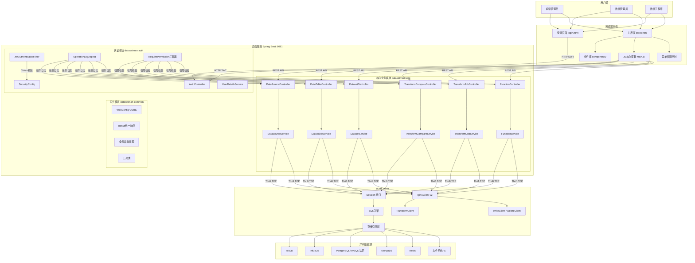
```mermaid
graph TB
    subgraph 用户层
        U1[超级管理员]
        U2[数据管理员]
        U3[数据工程师]
    end

    subgraph 浏览器前端
        F1[登录页面 login.html]
        F2[主界面 index.html]
        F3[组件库 components/]
        F4[JS核心逻辑 main.js]
        F5[菜单权限控制]
    end

    subgraph 后端服务 Spring Boot :8081
        subgraph 认证模块 datasetman-auth
            A1[AuthController]
            A2[JwtAuthenticationFilter]
            A3[SecurityConfig]
            A4[OperationLogAspect]
            A5[RequirePermission拦截器]
            A6[UserDetailsService]
        end
        subgraph 核心业务模块 datasetman-core
            C1[DataSourceController]
            C2[DataTableController]
            C3[DatasetController]
            C4[TransformCompareController]
            C5[TransformJobController]
            C6[FunctionController]
            S1[DataSourceService]
            S2[DataTableService]
            S3[DatasetService]
            S4[TransformCompareService]
            S5[TransformJobService]
            S6[FunctionService]
        end
        subgraph 公共模块 datasetman-common
            CM1[WebConfig CORS]
            CM2[Result统一响应]
            CM3[全局异常处理]
            CM4[工具类]
        end
    end

    subgraph IGinX 0.8.0
        IG1[Session 接口]
        IG2[IginXClient v2]
        IG3[TransformClient]
        IG4[WriteClient / DeleteClient]
        IG5[SQL引擎]
        IG6[存储引擎层]
    end

    subgraph 异构数据源
        DS1[IoTDB]
        DS2[InfluxDB]
        DS3[PostgreSQL/MySQL/达梦]
        DS4[MongoDB]
        DS5[Redis]
        DS6[文件系统FS]
    end

    U1 & U2 & U3 --> F1 & F2
    F2 --> F3 & F4 & F5
    F1 & F4 -->|HTTP/JWT| A1
    F4 -->|REST API| C1 & C2 & C3 & C4 & C5 & C6
    A2 -->|Token校验| A3
    A5 -->|权限校验| C1 & C2 & C3 & C4 & C5 & C6
    A4 -->|操作日志| C1 & C2 & C3 & C4 & C5 & C6
    C1 --> S1
    C2 --> S2
    C3 --> S3
    C4 --> S4
    C5 --> S5
    C6 --> S6
    S1 & S2 & S3 & S4 & S5 & S6 -->|Thrift TCP| IG1 & IG2
    IG2 --> IG3 & IG4
    IG1 --> IG5
    IG5 --> IG6
    IG6 --> DS1 & DS2 & DS3 & DS4 & DS5 & DS6
```

## 2.2 技术栈

| 层次 | 技术选型 | 版本 |
|---|---|---|
| 前端 | HTML5 + CSS3 + ES6+ | - |
| 前端图表 | ECharts | - |
| 前端组件 | 自研组件库（components/） | - |
| 后端框架 | Spring Boot | 2.7.18 |
| 安全框架 | Spring Security + JWT | - |
| 底层引擎 | IGinX | 0.8.0 |
| 通信协议 | Thrift | 0.22.0 |
| JSON | Jackson / FastJSON2 | 2.15.4 / 2.x |
| 构建工具 | Maven | - |
| JDK | Java | 1.8+ |
| 操作系统 | Windows / 国产OS | - |

## 2.3 模块划分

系统采用Maven多模块结构，共4个核心子模块：

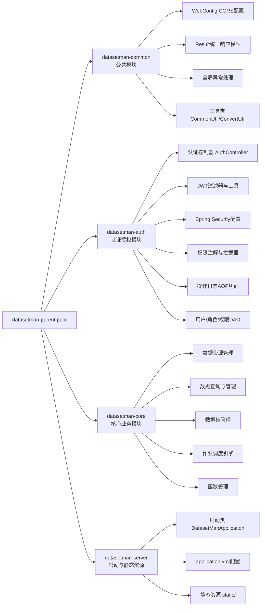
```mermaid
graph LR
    P[datasetman-parent pom]
    P --> M1[datasetman-common<br/>公共模块]
    P --> M2[datasetman-auth<br/>认证授权模块]
    P --> M3[datasetman-core<br/>核心业务模块]
    P --> M4[datasetman-server<br/>启动与静态资源]

    M1 --> M1a[WebConfig CORS配置]
    M1 --> M1b[Result统一响应模型]
    M1 --> M1c[全局异常处理]
    M1 --> M1d[工具类 CommonUtil/ConvertUtil]

    M2 --> M2a[认证控制器 AuthController]
    M2 --> M2b[JWT过滤器与工具]
    M2 --> M2c[Spring Security配置]
    M2 --> M2d[权限注解与拦截器]
    M2 --> M2e[操作日志AOP切面]
    M2 --> M2f[用户/角色/权限DAO]

    M3 --> M3a[数据资源管理]
    M3 --> M3b[数据查询与管理]
    M3 --> M3c[数据集管理]
    M3 --> M3d[作业调度引擎]
    M3 --> M3e[函数管理]

    M4 --> M4a[启动类 DatasetManApplication]
    M4 --> M4b[application.yml配置]
    M4 --> M4c[静态资源 static/]
```

### 2.3.1 模块职责说明

- **datasetman-common**：提供跨模块共享的基础设施，包括CORS跨域配置（`WebConfig`）、统一响应模型（`Result<T>`）、全局异常处理、通用工具类（`CommonUtil`用于SQL校验、`ConvertUtil`用于IGinX数据转换）。
- **datasetman-auth**：负责用户认证、授权、操作日志记录。包含JWT Token签发与校验、Spring Security配置、基于注解的细粒度权限控制（`@RequirePermission`）、操作日志AOP切面（`@OperationLog`）、用户与角色的DAO层管理。
- **datasetman-core**：系统核心业务逻辑，包含数据源管理、数据查询、数据集管理、Transform作业编排与执行、函数管理（Transform/UDF）等全部业务Service与Controller。
- **datasetman-server**：Spring Boot启动入口，承载静态前端资源，提供`application.yml`配置文件。

---

# 第3章 功能模块详细设计

## 3.1 数据资源管理

### 3.1.1 异构数据源接入

#### 模块设计

该模块负责建立系统与底层异构数据库的连接通道，支持IoTDB、InfluxDB、PostgreSQL、MySQL、Oracle、达梦、MongoDB、Redis、文件系统FS等数据源的注册与移除。

#### 类图

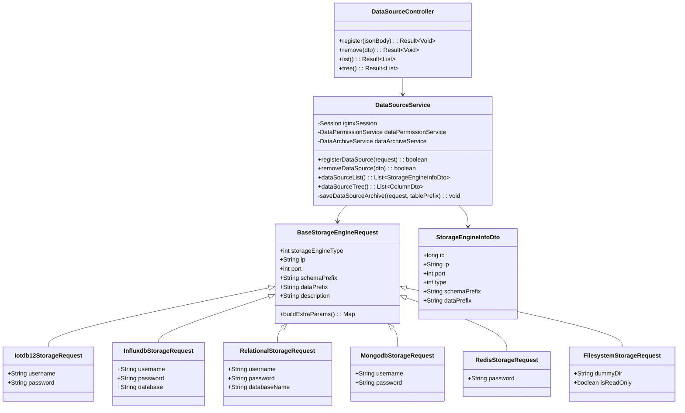
```mermaid
classDiagram
    class DataSourceController {
        +register(jsonBody): Result~Void~
        +remove(dto): Result~Void~
        +list(): Result~List~
        +tree(): Result~List~
    }
    class DataSourceService {
        -Session iginxSession
        -DataPermissionService dataPermissionService
        -DataArchiveService dataArchiveService
        +registerDataSource(request): boolean
        +removeDataSource(dto): boolean
        +dataSourceList(): List~StorageEngineInfoDto~
        +dataSourceTree(): List~ColumnDto~
        -saveDataSourceArchive(request, tablePrefix): void
    }
    class BaseStorageEngineRequest {
        +int storageEngineType
        +String ip
        +int port
        +String schemaPrefix
        +String dataPrefix
        +String description
        +buildExtraParams(): Map
    }
    class Iotdb12StorageRequest {
        +String username
        +String password
    }
    class InfluxdbStorageRequest {
        +String username
        +String password
        +String database
    }
    class RelationalStorageRequest {
        +String username
        +String password
        +String databaseName
    }
    class MongodbStorageRequest {
        +String username
        +String password
    }
    class RedisStorageRequest {
        +String password
    }
    class FilesystemStorageRequest {
        +String dummyDir
        +boolean isReadOnly
    }
    class StorageEngineInfoDto {
        +long id
        +String ip
        +int port
        +int type
        +String schemaPrefix
        +String dataPrefix
    }

    DataSourceController --> DataSourceService
    DataSourceService --> BaseStorageEngineRequest
    BaseStorageEngineRequest <|-- Iotdb12StorageRequest
    BaseStorageEngineRequest <|-- InfluxdbStorageRequest
    BaseStorageEngineRequest <|-- RelationalStorageRequest
    BaseStorageEngineRequest <|-- MongodbStorageRequest
    BaseStorageEngineRequest <|-- RedisStorageRequest
    BaseStorageEngineRequest <|-- FilesystemStorageRequest
    DataSourceService --> StorageEngineInfoDto
```

#### 注册数据源流程

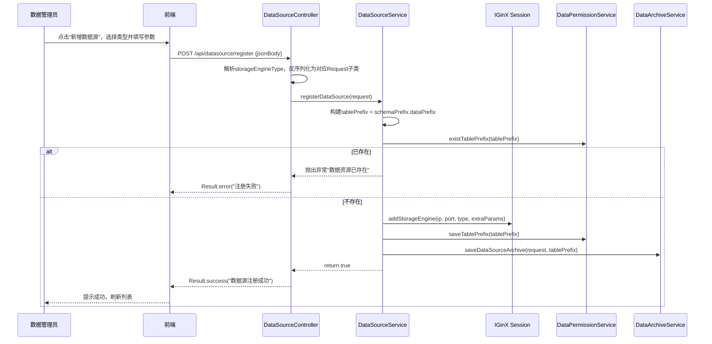
```mermaid
sequenceDiagram
    participant U as 数据管理员
    participant F as 前端
    participant C as DataSourceController
    participant S as DataSourceService
    participant I as IGinX Session
    participant P as DataPermissionService
    participant A as DataArchiveService

    U->>F: 点击"新增数据源"，选择类型并填写参数
    F->>C: POST /api/datasource/register {jsonBody}
    C->>C: 解析storageEngineType，反序列化为对应Request子类
    C->>S: registerDataSource(request)
    S->>S: 构建tablePrefix = schemaPrefix.dataPrefix
    S->>P: existTablePrefix(tablePrefix)
    alt 已存在
        S-->>C: 抛出异常"数据资源已存在"
        C-->>F: Result.error("注册失败")
    else 不存在
        S->>I: addStorageEngine(ip, port, type, extraParams)
        S->>P: saveTablePrefix(tablePrefix)
        S->>A: saveDataSourceArchive(request, tablePrefix)
        S-->>C: return true
        C-->>F: Result.success("数据源注册成功")
        F-->>U: 提示成功，刷新列表
    end
```

#### 数据源类型映射

| storageEngineType | 数据源类型 | Request子类 |
|---|---|---|
| 1 | IoTDB | `Iotdb12StorageRequest` |
| 2 | InfluxDB | `InfluxdbStorageRequest` |
| 3 | 文件系统FS | `FilesystemStorageRequest` |
| 4 | 关系型数据库 | `RelationalStorageRequest` |
| 5 | MongoDB | `MongodbStorageRequest` |
| 6 | Redis | `RedisStorageRequest` |

#### 移除数据源流程

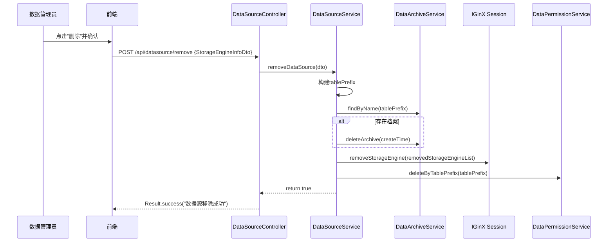
```mermaid
sequenceDiagram
    participant U as 数据管理员
    participant F as 前端
    participant C as DataSourceController
    participant S as DataSourceService
    participant A as DataArchiveService
    participant I as IGinX Session
    participant P as DataPermissionService

    U->>F: 点击"删除"并确认
    F->>C: POST /api/datasource/remove {StorageEngineInfoDto}
    C->>S: removeDataSource(dto)
    S->>S: 构建tablePrefix
    S->>A: findByName(tablePrefix)
    alt 存在档案
        S->>A: deleteArchive(createTime)
    end
    S->>I: removeStorageEngine(removedStorageEngineList)
    S->>P: deleteByTablePrefix(tablePrefix)
    S-->>C: return true
    C-->>F: Result.success("数据源移除成功")
```

### 3.1.2 数据查询与管理

#### 模块设计

该模块提供可视化数据交互窗口，支持时序数据、结构化数据、半结构化数据、键值数据、文件数据五类差异化检索与展示。

#### 类图

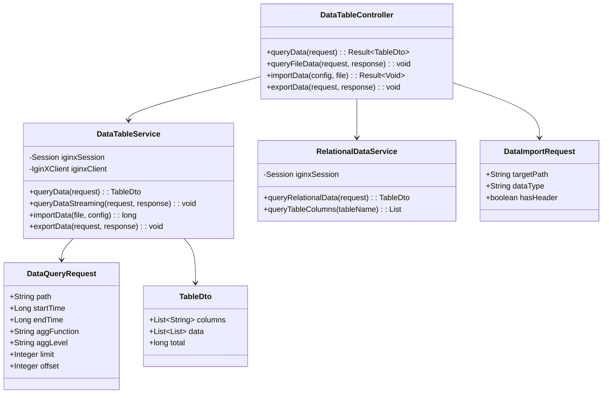
```mermaid
classDiagram
    class DataTableController {
        +queryData(request): Result~TableDto~
        +queryFileData(request, response): void
        +importData(config, file): Result~Void~
        +exportData(request, response): void
    }
    class DataTableService {
        -Session iginxSession
        -IginXClient iginxClient
        +queryData(request): TableDto
        +queryDataStreaming(request, response): void
        +importData(file, config): long
        +exportData(request, response): void
    }
    class RelationalDataService {
        -Session iginxSession
        +queryRelationalData(request): TableDto
        +queryTableColumns(tableName): List
    }
    class DataQueryRequest {
        +String path
        +Long startTime
        +Long endTime
        +String aggFunction
        +String aggLevel
        +Integer limit
        +Integer offset
    }
    class TableDto {
        +List~String~ columns
        +List~List~ data
        +long total
    }
    class DataImportRequest {
        +String targetPath
        +String dataType
        +boolean hasHeader
    }

    DataTableController --> DataTableService
    DataTableController --> RelationalDataService
    DataTableService --> DataQueryRequest
    DataTableService --> TableDto
    DataTableController --> DataImportRequest
```

#### 数据查询流程

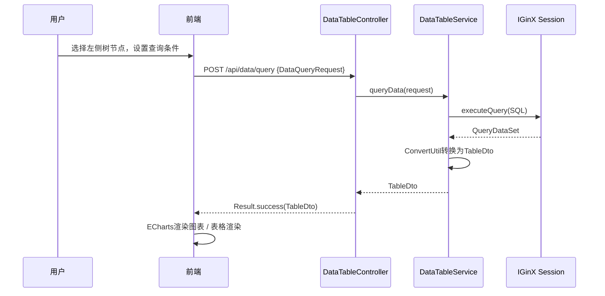
```mermaid
sequenceDiagram
    participant U as 用户
    participant F as 前端
    participant C as DataTableController
    participant S as DataTableService
    participant I as IGinX Session

    U->>F: 选择左侧树节点，设置查询条件
    F->>C: POST /api/data/query {DataQueryRequest}
    C->>S: queryData(request)
    S->>I: executeQuery(SQL)
    I-->>S: QueryDataSet
    S->>S: ConvertUtil转换为TableDto
    S-->>C: TableDto
    C-->>F: Result.success(TableDto)
    F->>F: ECharts渲染图表 / 表格渲染
```

#### 数据类型差异化展示策略

| 数据类型 | 展示方式 | 前端组件 |
|---|---|---|
| 时序数据 | 趋势折线图 + 分页表格 | ECharts + data-visualization |
| 结构化数据 | 二维表格（列排序/筛选） | database-table |
| 半结构化数据 | JSON树形折叠展示 | semi-structured-viewer |
| 键值数据 | 单键聚焦详情面板 | key-value-viewer |
| 文件数据 | 按类型智能预览（图片/音频/视频/文档） | file-system-browser |

### 3.1.3 数据资源树

数据资源树通过`DataSourceService.dataSourceTree()`方法实现，调用IGinX的`showColumns()`接口获取所有列路径，过滤掉`relational_system`系统路径后返回前端。前端以树状结构展示 `Alias → Groups/Schemas → Measurements/Tables` 三级层级。

非管理员用户仅能查看其有权限的数据源（通过`DataPermissionService.getCurrentUserAccessibleTables()`过滤）。

---

## 3.2 数据集管理

### 3.2.1 数据集配置

#### 模块设计

数据集配置模块负责数据集的全生命周期管理（创建、编辑、删除、查询）。用户通过编写IGinX-SQL语句从任意数据源选取数据，保存为可追溯的数据集。

#### 类图

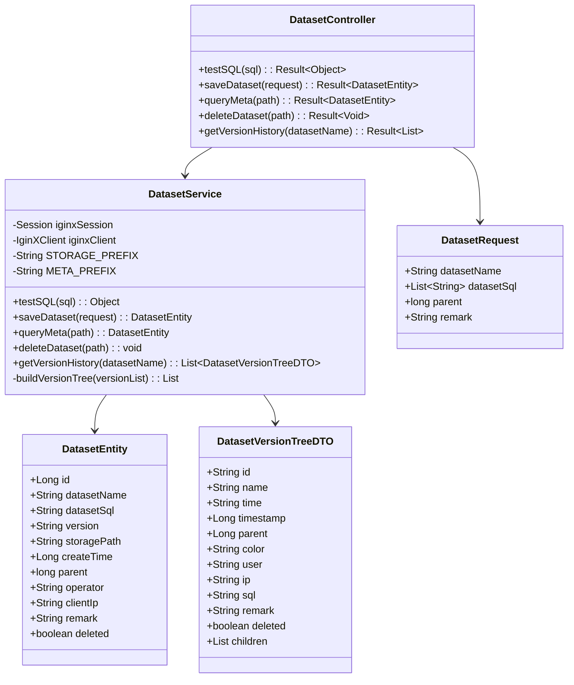
```mermaid
classDiagram
    class DatasetController {
        +testSQL(sql): Result~Object~
        +saveDataset(request): Result~DatasetEntity~
        +queryMeta(path): Result~DatasetEntity~
        +deleteDataset(path): Result~Void~
        +getVersionHistory(datasetName): Result~List~
    }
    class DatasetService {
        -Session iginxSession
        -IginXClient iginxClient
        -String STORAGE_PREFIX
        -String META_PREFIX
        +testSQL(sql): Object
        +saveDataset(request): DatasetEntity
        +queryMeta(path): DatasetEntity
        +deleteDataset(path): void
        +getVersionHistory(datasetName): List~DatasetVersionTreeDTO~
        -buildVersionTree(versionList): List
    }
    class DatasetEntity {
        +Long id
        +String datasetName
        +String datasetSql
        +String version
        +String storagePath
        +Long createTime
        +long parent
        +String operator
        +String clientIp
        +String remark
        +boolean deleted
    }
    class DatasetRequest {
        +String datasetName
        +List~String~ datasetSql
        +long parent
        +String remark
    }
    class DatasetVersionTreeDTO {
        +String id
        +String name
        +String time
        +Long timestamp
        +Long parent
        +String color
        +String user
        +String ip
        +String sql
        +String remark
        +boolean deleted
        +List children
    }

    DatasetController --> DatasetService
    DatasetService --> DatasetEntity
    DatasetController --> DatasetRequest
    DatasetService --> DatasetVersionTreeDTO
```

#### 数据集存储设计

数据集元数据存储在IGinX中，使用两个前缀：

- **`dataset.*`**：存储数据集SQL定义（以二进制格式存储）
- **`relational_system.dataset_meta`**：存储数据集元信息（名称、版本、操作人、IP等）

`DatasetEntity`使用IGinX Session v2的`@Measurement`和`@Field`注解，通过`WriteClient.writeMeasurement()`直接写入。

#### 创建数据集流程

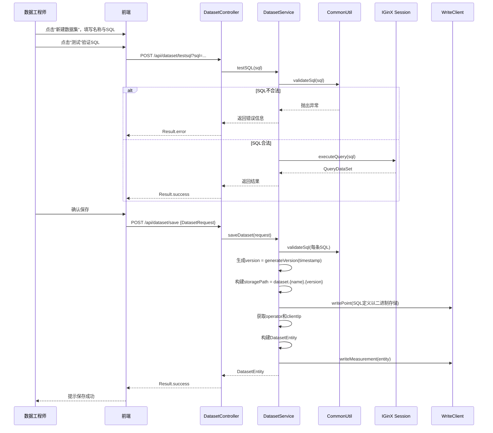
```mermaid
sequenceDiagram
    participant U as 数据工程师
    participant F as 前端
    participant C as DatasetController
    participant S as DatasetService
    participant V as CommonUtil
    participant I as IGinX Session
    participant W as WriteClient

    U->>F: 点击"新建数据集"，填写名称与SQL
    U->>F: 点击"测试"验证SQL
    F->>C: POST /api/dataset/testsql?sql=...
    C->>S: testSQL(sql)
    S->>V: validateSql(sql)
    alt SQL不合法
        V-->>S: 抛出异常
        S-->>C: 返回错误信息
        C-->>F: Result.error
    else SQL合法
        S->>I: executeQuery(sql)
        I-->>S: QueryDataSet
        S-->>C: 返回结果
        C-->>F: Result.success
    end

    U->>F: 确认保存
    F->>C: POST /api/dataset/save {DatasetRequest}
    C->>S: saveDataset(request)
    S->>V: validateSql(每条SQL)
    S->>S: 生成version = generateVersion(timestamp)
    S->>S: 构建storagePath = dataset.{name}.{version}
    S->>W: writePoint(SQL定义以二进制存储)
    S->>S: 获取operator和clientIp
    S->>S: 构建DatasetEntity
    S->>W: writeMeasurement(entity)
    S-->>C: DatasetEntity
    C-->>F: Result.success
    F-->>U: 提示保存成功
```

#### SQL安全校验

`CommonUtil.validateSql()`方法对SQL进行安全校验：
- 仅允许 `SELECT` 类型SQL语句
- 禁止危险关键字：`DELETE`、`UPDATE`、`INSERT`、`DROP`、`ALTER`、`TRUNCATE`

#### 版本管理设计

数据集采用版本树结构管理变更历史：
- 每次保存生成唯一版本号（基于时间戳）
- `parent`字段记录父版本的时间戳，根版本`parent=0`
- `getVersionHistory()`查询所有版本并构建树形结构返回前端
- 删除采用逻辑删除（`deleted=true`），保留历史记录

### 3.2.2 变化历史追溯

#### 模块设计

变化历史追溯模块提供数据集变化过程的可视化展示，包括血缘图谱和时间线。

#### 血缘图谱流程

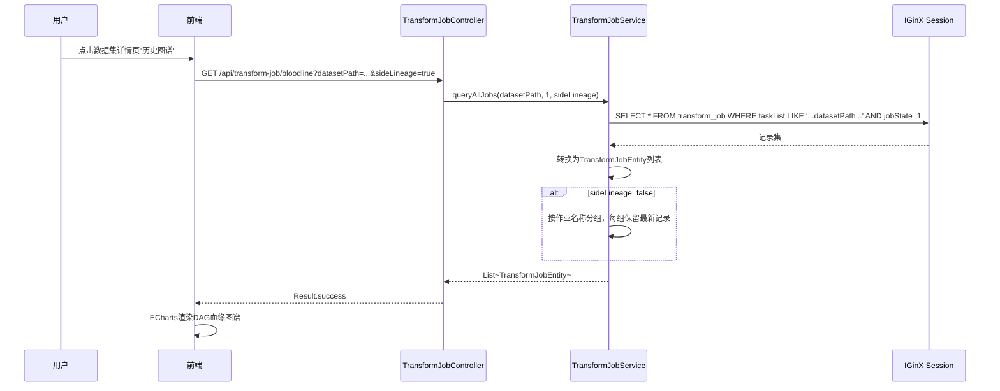
```mermaid
sequenceDiagram
    participant U as 用户
    participant F as 前端
    participant C as TransformJobController
    participant S as TransformJobService
    participant I as IGinX Session

    U->>F: 点击数据集详情页"历史图谱"
    F->>C: GET /api/transform-job/bloodline?datasetPath=...&sideLineage=true
    C->>S: queryAllJobs(datasetPath, 1, sideLineage)
    S->>I: SELECT * FROM transform_job WHERE taskList LIKE '...datasetPath...' AND jobState=1
    I-->>S: 记录集
    S->>S: 转换为TransformJobEntity列表
    alt sideLineage=false
        S->>S: 按作业名称分组，每组保留最新记录
    end
    S-->>C: List~TransformJobEntity~
    C-->>F: Result.success
    F->>F: ECharts渲染DAG血缘图谱
```

#### 时间线展示

时间线通过`DatasetService.getVersionHistory()`获取数据集版本树，前端以时间轴形式展示各版本节点，包含版本号、操作人、IP、时间、SQL等信息。

---

## 3.3 作业调度引擎

### 3.3.1 编排 Transform 作业

#### 模块设计

该模块提供可视化配置界面，允许数据工程师定义数据集如何通过IGinX Transform任务进行转换。作业配置（`TransformCompareEntity`）与作业执行实例（`TransformJobEntity`）分离存储。

#### 类图

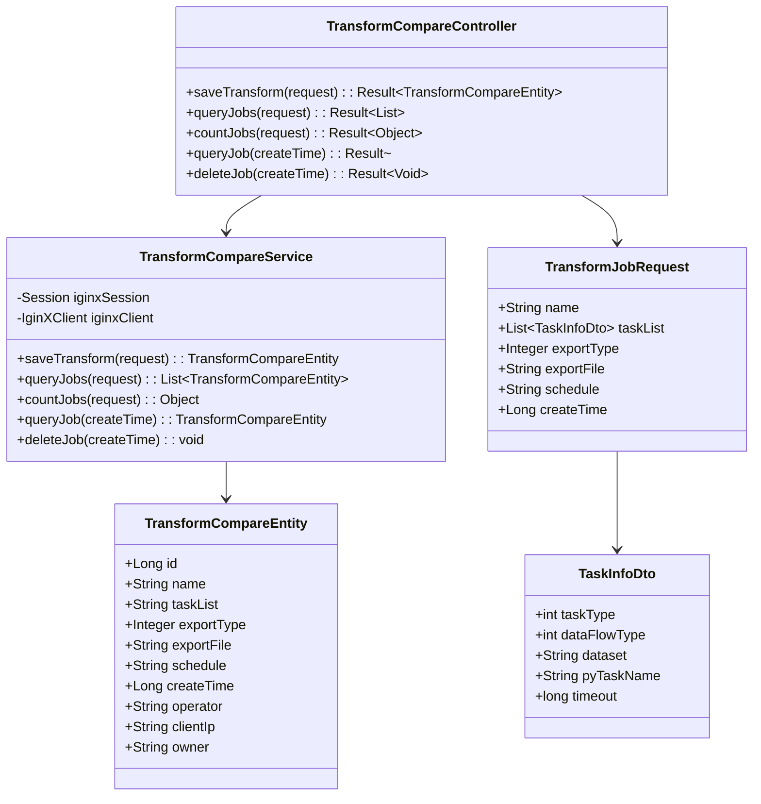
```mermaid
classDiagram
    class TransformCompareController {
        +saveTransform(request): Result~TransformCompareEntity~
        +queryJobs(request): Result~List~
        +countJobs(request): Result~Object~
        +queryJob(createTime): Result~
        +deleteJob(createTime): Result~Void~
    }
    class TransformCompareService {
        -Session iginxSession
        -IginXClient iginxClient
        +saveTransform(request): TransformCompareEntity
        +queryJobs(request): List~TransformCompareEntity~
        +countJobs(request): Object
        +queryJob(createTime): TransformCompareEntity
        +deleteJob(createTime): void
    }
    class TransformCompareEntity {
        +Long id
        +String name
        +String taskList
        +Integer exportType
        +String exportFile
        +String schedule
        +Long createTime
        +String operator
        +String clientIp
        +String owner
    }
    class TransformJobRequest {
        +String name
        +List~TaskInfoDto~ taskList
        +Integer exportType
        +String exportFile
        +String schedule
        +Long createTime
    }
    class TaskInfoDto {
        +int taskType
        +int dataFlowType
        +String dataset
        +String pyTaskName
        +long timeout
    }

    TransformCompareController --> TransformCompareService
    TransformCompareService --> TransformCompareEntity
    TransformCompareController --> TransformJobRequest
    TransformJobRequest --> TaskInfoDto
```

#### 作业编排流程

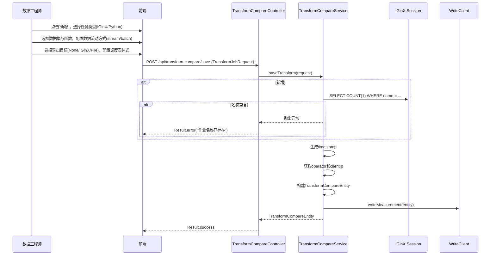
```mermaid
sequenceDiagram
    participant U as 数据工程师
    participant F as 前端
    participant C as TransformCompareController
    participant S as TransformCompareService
    participant I as IGinX Session
    participant W as WriteClient

    U->>F: 点击"新增"，选择任务类型(IGinX/Python)
    U->>F: 选择数据集与函数，配置数据流动方式(stream/batch)
    U->>F: 选择输出目标(None/IGinX/File)，配置调度表达式
    F->>C: POST /api/transform-compare/save {TransformJobRequest}
    C->>S: saveTransform(request)
    alt 新增
        S->>I: SELECT COUNT(1) WHERE name = ...
        alt 名称重复
            S-->>C: 抛出异常
            C-->>F: Result.error("作业名称已存在")
        end
    end
    S->>S: 生成timestamp
    S->>S: 获取operator和clientIp
    S->>S: 构建TransformCompareEntity
    S->>W: writeMeasurement(entity)
    S-->>C: TransformCompareEntity
    C-->>F: Result.success
```

#### 任务类型与数据流动

| 字段 | 可选值 | 说明 |
|---|---|---|
| taskType | `IGINX` / `Python` | IGinX查询任务 / Transform脚本任务 |
| dataFlowType | `Stream` / `Batch` | 流式任务 / 批式任务 |
| exportType | `None(0)` / `IGinX(1)` / `File(2)` | 不导出 / 写回IGinX / 写入文件 |

**约束**：每个合法Transform Job必须包含至少一个task，且第一个task必须为IGinX查询任务。

### 3.3.2 Transform任务执行

#### 模块设计

该模块负责接收用户操作指令，将编排好的作业提交至IGinX执行，并管理执行状态。

#### 类图

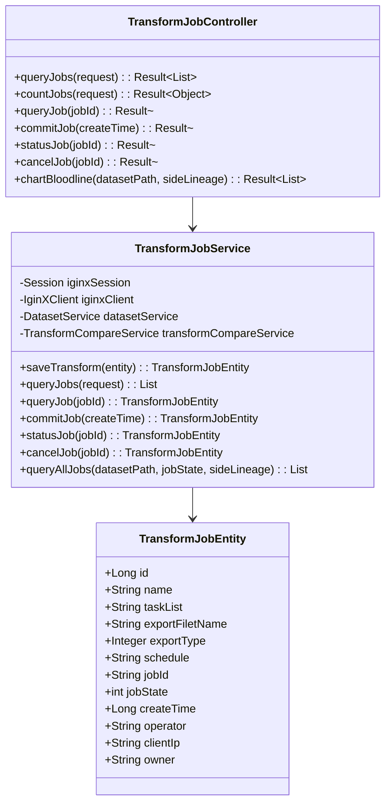
```mermaid
classDiagram
    class TransformJobController {
        +queryJobs(request): Result~List~
        +countJobs(request): Result~Object~
        +queryJob(jobId): Result~
        +commitJob(createTime): Result~
        +statusJob(jobId): Result~
        +cancelJob(jobId): Result~
        +chartBloodline(datasetPath, sideLineage): Result~List~
    }
    class TransformJobService {
        -Session iginxSession
        -IginXClient iginxClient
        -DatasetService datasetService
        -TransformCompareService transformCompareService
        +saveTransform(entity): TransformJobEntity
        +queryJobs(request): List
        +queryJob(jobId): TransformJobEntity
        +commitJob(createTime): TransformJobEntity
        +statusJob(jobId): TransformJobEntity
        +cancelJob(jobId): TransformJobEntity
        +queryAllJobs(datasetPath, jobState, sideLineage): List
    }
    class TransformJobEntity {
        +Long id
        +String name
        +String taskList
        +String exportFiletName
        +Integer exportType
        +String schedule
        +String jobId
        +int jobState
        +Long createTime
        +String operator
        +String clientIp
        +String owner
    }

    TransformJobController --> TransformJobService
    TransformJobService --> TransformJobEntity
```

#### 作业提交执行流程

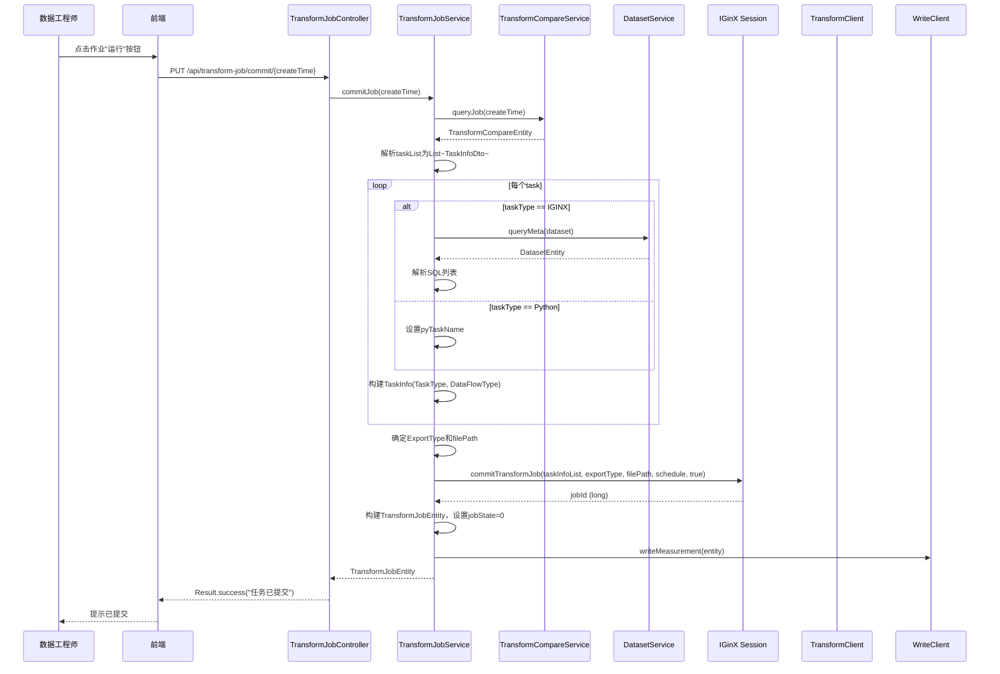
```mermaid
sequenceDiagram
    participant U as 数据工程师
    participant F as 前端
    participant C as TransformJobController
    participant S as TransformJobService
    participant CS as TransformCompareService
    participant DS as DatasetService
    participant I as IGinX Session
    participant T as TransformClient
    participant W as WriteClient

    U->>F: 点击作业"运行"按钮
    F->>C: PUT /api/transform-job/commit/{createTime}
    C->>S: commitJob(createTime)
    S->>CS: queryJob(createTime)
    CS-->>S: TransformCompareEntity
    S->>S: 解析taskList为List~TaskInfoDto~
    loop 每个task
        alt taskType == IGINX
            S->>DS: queryMeta(dataset)
            DS-->>S: DatasetEntity
            S->>S: 解析SQL列表
        else taskType == Python
            S->>S: 设置pyTaskName
        end
        S->>S: 构建TaskInfo(TaskType, DataFlowType)
    end
    S->>S: 确定ExportType和filePath
    S->>I: commitTransformJob(taskInfoList, exportType, filePath, schedule, true)
    I-->>S: jobId (long)
    S->>S: 构建TransformJobEntity，设置jobState=0
    S->>W: writeMeasurement(entity)
    S-->>C: TransformJobEntity
    C-->>F: Result.success("任务已提交")
    F-->>U: 提示已提交
```

#### 作业状态管理

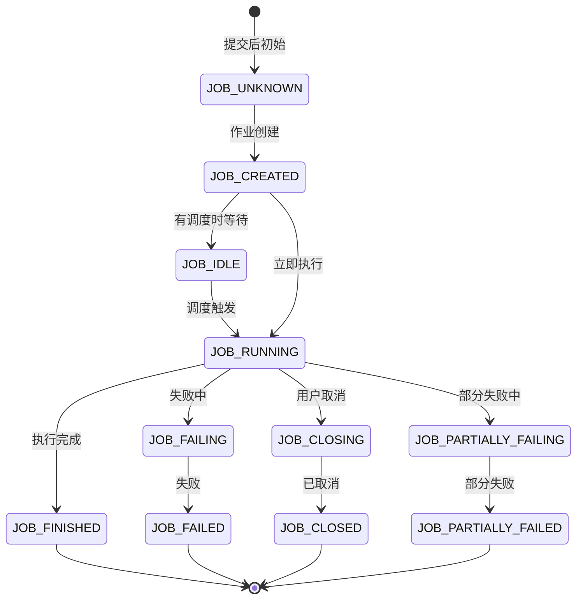
```mermaid
stateDiagram-v2
    [*] --> JOB_UNKNOWN: 提交后初始
    JOB_UNKNOWN --> JOB_CREATED: 作业创建
    JOB_CREATED --> JOB_IDLE: 有调度时等待
    JOB_IDLE --> JOB_RUNNING: 调度触发
    JOB_CREATED --> JOB_RUNNING: 立即执行
    JOB_RUNNING --> JOB_FINISHED: 执行完成
    JOB_RUNNING --> JOB_PARTIALLY_FAILING: 部分失败中
    JOB_PARTIALLY_FAILING --> JOB_PARTIALLY_FAILED: 部分失败
    JOB_RUNNING --> JOB_FAILING: 失败中
    JOB_FAILING --> JOB_FAILED: 失败
    JOB_RUNNING --> JOB_CLOSING: 用户取消
    JOB_CLOSING --> JOB_CLOSED: 已取消
    JOB_FINISHED --> [*]
    JOB_FAILED --> [*]
    JOB_CLOSED --> [*]
    JOB_PARTIALLY_FAILED --> [*]
```

#### 作业状态码

| 状态码 | 枚举值 | 说明 |
|---|---|---|
| 0 | JOB_UNKNOWN | 作业状态未知 |
| 1 | JOB_FINISHED | 作业完成 |
| 2 | JOB_CREATED | 作业创建 |
| 3 | JOB_IDLE | 作业等待运行 |
| 4 | JOB_RUNNING | 作业运行中 |
| 5 | JOB_PARTIALLY_FAILING | 作业部分失败中 |
| 6 | JOB_PARTIALLY_FAILED | 作业部分失败 |
| 7 | JOB_FAILING | 作业失败中 |
| 8 | JOB_FAILED | 作业失败 |
| 9 | JOB_CLOSING | 作业取消中 |
| 10 | JOB_CLOSED | 作业取消 |

---

## 3.4 函数管理

### 3.4.1 Transform托管

#### 模块设计

负责Transform脚本（.py）的生命周期管理：注册（上传+注册到IGinX）、删除（物理删除文件+DROP FUNCTION）、查询、下载。

#### 类图

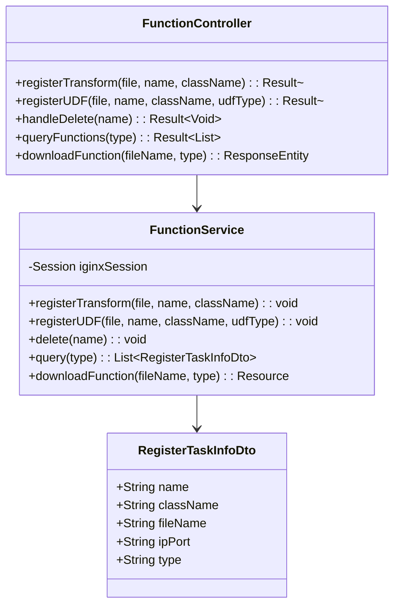
```mermaid
classDiagram
    class FunctionController {
        +registerTransform(file, name, className): Result~
        +registerUDF(file, name, className, udfType): Result~
        +handleDelete(name): Result~Void~
        +queryFunctions(type): Result~List~
        +downloadFunction(fileName, type): ResponseEntity
    }
    class FunctionService {
        -Session iginxSession
        +registerTransform(file, name, className): void
        +registerUDF(file, name, className, udfType): void
        +delete(name): void
        +query(type): List~RegisterTaskInfoDto~
        +downloadFunction(fileName, type): Resource
    }
    class RegisterTaskInfoDto {
        +String name
        +String className
        +String fileName
        +String ipPort
        +String type
    }

    FunctionController --> FunctionService
    FunctionService --> RegisterTaskInfoDto
```

#### Transform注册流程

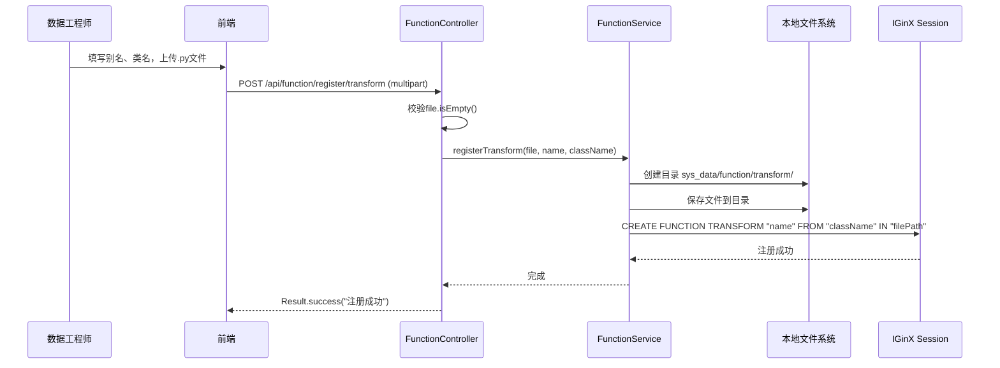
```mermaid
sequenceDiagram
    participant U as 数据工程师
    participant F as 前端
    participant C as FunctionController
    participant S as FunctionService
    participant FS as 本地文件系统
    participant I as IGinX Session

    U->>F: 填写别名、类名，上传.py文件
    F->>C: POST /api/function/register/transform (multipart)
    C->>C: 校验file.isEmpty()
    C->>S: registerTransform(file, name, className)
    S->>FS: 创建目录 sys_data/function/transform/
    S->>FS: 保存文件到目录
    S->>I: CREATE FUNCTION TRANSFORM "name" FROM "className" IN "filePath"
    I-->>S: 注册成功
    S-->>C: 完成
    C-->>F: Result.success("注册成功")
```

#### Transform删除流程

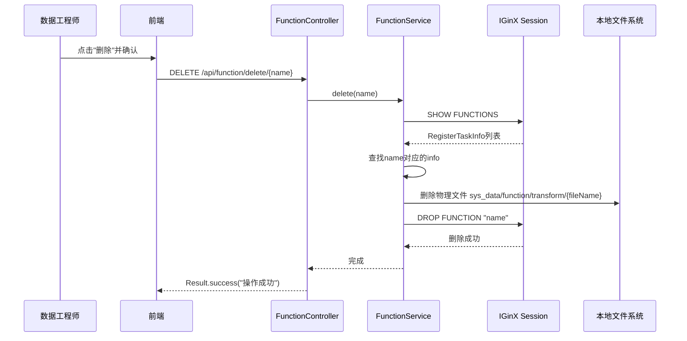
```mermaid
sequenceDiagram
    participant U as 数据工程师
    participant F as 前端
    participant C as FunctionController
    participant S as FunctionService
    participant I as IGinX Session
    participant FS as 本地文件系统

    U->>F: 点击"删除"并确认
    F->>C: DELETE /api/function/delete/{name}
    C->>S: delete(name)
    S->>I: SHOW FUNCTIONS
    I-->>S: RegisterTaskInfo列表
    S->>S: 查找name对应的info
    S->>FS: 删除物理文件 sys_data/function/transform/{fileName}
    S->>I: DROP FUNCTION "name"
    I-->>S: 删除成功
    S-->>C: 完成
    C-->>F: Result.success("操作成功")
```

### 3.4.2 UDF托管

UDF托管与Transform托管类似，区别在于：
- 文件存储路径：`sys_data/function/udf/`
- 注册SQL格式：`CREATE FUNCTION {udfType} "{name}" FROM "{className}" IN "{filePath}"`
- 支持三种UDF类型：UDAF（聚合）、UDTF（表值）、UDSF（标量）

---

# 第4章 认证与安全设计

## 4.1 认证架构

系统采用Spring Security + JWT的无状态认证方案，不使用Session。

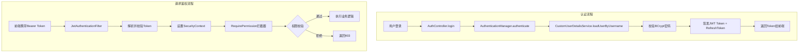
```mermaid
graph TB
    subgraph 认证流程
        L1[用户登录] --> L2[AuthController.login]
        L2 --> L3[AuthenticationManager.authenticate]
        L3 --> L4[CustomUserDetailsService.loadUserByUsername]
        L4 --> L5[校验BCrypt密码]
        L5 --> L6[签发JWT Token + RefreshToken]
        L6 --> L7[返回Token给前端]
    end

    subgraph 请求鉴权流程
        R1[前端携带Bearer Token] --> R2[JwtAuthenticationFilter]
        R2 --> R3[解析并校验Token]
        R3 --> R4[设置SecurityContext]
        R4 --> R5[RequirePermission拦截器]
        R5 --> R6{权限校验}
        R6 -->|通过| R7[执行业务逻辑]
        R6 -->|拒绝| R8[返回403]
    end
```

## 4.2 安全配置

### 4.2.1 SecurityConfig 配置

- **CSRF**：禁用（前后端分离，使用JWT）
- **Session**：`STATELESS`（无状态）
- **CORS**：允许所有源、所有方法、所有头
- **放行路径**：静态资源、登录页、`/api/auth/**`、API文档
- **认证路径**：所有 `/api/**` 请求需要JWT认证
- **异常处理**：API请求返回401 JSON，页面请求重定向到登录页

### 4.2.2 权限控制

采用基于注解的细粒度权限控制：

```mermaid
graph LR
    A[@RequirePermission 注解] --> B[RequirePermission拦截器]
    B --> C{用户是否拥有该权限?}
    C -->|是| D[放行执行]
    C -->|否| E[抛出AccessDeniedException]
    
    F[@OperationLog 注解] --> G[OperationLogAspect AOP切面]
    G --> H[记录操作人/IP/参数/结果/耗时]
```

#### 权限枚举

| 权限分组 | 权限项 |
|---|---|
| 数据源管理 | DATASOURCE_CREATE / READ / UPDATE / DELETE |
| 数据管理 | DATA_CREATE / READ / UPDATE / DELETE |
| 通用 | CREATE / READ / UPDATE / DELETE |
| 用户管理 | USER_CREATE / READ / UPDATE / DELETE |

### 4.2.3 JWT配置

| 配置项 | 值 | 说明 |
|---|---|---|
| secret | 自定义密钥 | JWT签名密钥 |
| expiration | 28800000ms (8小时) | Access Token有效期 |
| refresh-expiration | 43200000ms (12小时) | Refresh Token有效期 |

### 4.2.4 操作日志

通过`@OperationLog`注解 + AOP切面自动记录操作日志，包含：
- 操作人、IP地址
- 操作描述、操作类型（CREATE/UPDATE/DELETE/QUERY/IMPORT/EXPORT/LOGIN）
- 请求方法、请求参数、返回结果
- 执行状态、耗时、错误信息
- 请求URI、User-Agent

---

# 第5章 接口设计

## 5.1 API总览

```mermaid
graph LR
    subgraph 认证API /api/auth
        A1[POST /login 登录]
        A2[POST /refresh 刷新Token]
    end

    subgraph 数据源API /api/datasource
        D1[POST /register 注册]
        D2[POST /remove 移除]
        D3[GET /list 列表]
        D4[GET /tree 资源树]
    end

    subgraph 数据查询API /api/data
        Q1[POST /query 数据查询]
        Q2[POST /fs/query 文件流式查询]
        Q3[POST /import 数据导入]
        Q4[POST /export 数据导出]
    end

    subgraph 数据集API /api/dataset
        DS1[POST /testsql SQL测试]
        DS2[POST /save 保存数据集]
        DS3[GET /metas 数据集详情]
        DS4[DELETE /delete 删除数据集]
        DS5[GET /history 版本历史]
    end

    subgraph 作业编排API /api/transform-compare
        TC1[POST /save 保存作业]
        TC2[POST /query 分页查询]
        TC3[POST /count 总数]
        TC4[GET /detail 详情]
        TC5[DELETE /delete 删除]
    end

    subgraph 作业执行API /api/transform-job
        TJ1[POST /query 分页查询]
        TJ2[POST /count 总数]
        TJ3[GET /detail/{jobId} 详情]
        TJ4[PUT /commit/{createTime} 提交执行]
        TJ5[GET /status/{jobId} 刷新状态]
        TJ6[PUT /cancel/{jobId} 取消任务]
        TJ7[GET /bloodline 血缘图谱]
    end

    subgraph 函数API /api/function
        F1[POST /register/transform 注册Transform]
        F2[POST /register/udf 注册UDF]
        F3[DELETE /delete/{name} 删除函数]
        F4[GET /list 查询函数列表]
        F5[GET /download 下载函数文件]
    end
```

## 5.2 统一响应格式

所有API返回统一的JSON结构：

```json
{
  "code": 200,
  "message": "success",
  "data": { ... }
}
```

| 状态码 | 含义 |
|---|---|
| 200 | 成功 |
| 401 | 未认证 |
| 403 | 无权限 |
| 500 | 内部错误 |

## 5.3 接口详细说明

### 5.3.1 数据源管理接口

| 接口 | 方法 | 路径 | 权限 | 说明 |
|---|---|---|---|---|
| 注册数据源 | POST | `/api/datasource/register` | DATASOURCE_CREATE | 根据storageEngineType动态反序列化请求体 |
| 移除数据源 | POST | `/api/datasource/remove` | DATASOURCE_DELETE | 传入StorageEngineInfoDto |
| 数据源列表 | GET | `/api/datasource/list` | DATASOURCE_READ | 非管理员仅返回有权限的数据源 |
| 数据资源树 | GET | `/api/datasource/tree` | DATASOURCE_READ | 返回所有列路径的树结构 |

### 5.3.2 数据查询接口

| 接口 | 方法 | 路径 | 权限 | 说明 |
|---|---|---|---|---|
| 数据查询 | POST | `/api/data/query` | DATA_READ | 支持时序/结构化数据查询 |
| 文件流式查询 | POST | `/api/data/fs/query` | DATA_READ | 专用于大文件，流式输出 |
| 数据导入 | POST | `/api/data/import` | DATA_CREATE | multipart上传，config为JSON |
| 数据导出 | POST | `/api/data/export` | DATA_READ | 流式导出到HttpServletResponse |

### 5.3.3 数据集管理接口

| 接口 | 方法 | 路径 | 权限 | 说明 |
|---|---|---|---|---|
| SQL测试 | POST | `/api/dataset/testsql` | UPDATE | 校验并执行SELECT语句 |
| 保存数据集 | POST | `/api/dataset/save` | UPDATE | 创建/编辑数据集，生成版本 |
| 数据集详情 | GET | `/api/dataset/metas` | READ | 按path查询元信息 |
| 删除数据集 | DELETE | `/api/dataset/delete` | DELETE | 逻辑删除 |
| 版本历史 | GET | `/api/dataset/history` | READ | 返回版本树形结构 |

### 5.3.4 作业调度接口

| 接口 | 方法 | 路径 | 权限 | 说明 |
|---|---|---|---|---|
| 保存作业编排 | POST | `/api/transform-compare/save` | CREATE | 创建/编辑作业配置 |
| 查询作业编排列表 | POST | `/api/transform-compare/query` | READ | 分页查询 |
| 查询作业编排总数 | POST | `/api/transform-compare/count` | READ | 分页总数 |
| 作业编排详情 | GET | `/api/transform-compare/detail` | READ | 按createTime查询 |
| 删除作业编排 | DELETE | `/api/transform-compare/delete` | DELETE | 按createTime删除 |
| 提交作业执行 | PUT | `/api/transform-job/commit/{createTime}` | UPDATE | 从编排配置生成执行实例 |
| 查询执行状态 | GET | `/api/transform-job/status/{jobId}` | READ | 刷新并更新状态 |
| 取消作业 | PUT | `/api/transform-job/cancel/{jobId}` | UPDATE | 取消运行中作业 |
| 血缘图谱 | GET | `/api/transform-job/bloodline` | READ | 按数据集路径查询完成作业 |

### 5.3.5 函数管理接口

| 接口 | 方法 | 路径 | 权限 | 说明 |
|---|---|---|---|---|
| 注册Transform | POST | `/api/function/register/transform` | CREATE | multipart上传.py文件 |
| 注册UDF | POST | `/api/function/register/udf` | CREATE | multipart上传，含udfType |
| 删除函数 | DELETE | `/api/function/delete/{name}` | DELETE | 硬删除，不可恢复 |
| 查询函数列表 | GET | `/api/function/list` | READ | 按type过滤(transform/udf/all) |
| 下载函数 | GET | `/api/function/download` | READ | 返回文件Resource |

---

# 第6章 数据存储设计

## 6.1 存储架构

系统不使用独立数据库，所有元数据通过IGinX Session接口存储。使用`relational_system.*`前缀作为系统元数据命名空间，使用`dataset.*`前缀存储数据集SQL定义。

```mermaid
graph TB
    subgraph IGinX存储命名空间
        subgraph 系统元数据 relational_system.*
            RS1[relational_system.dataset_meta<br/>数据集元信息]
            RS2[relational_system.transform_compare<br/>作业编排配置]
            RS3[relational_system.transform_job<br/>作业执行实例]
            RS4[relational_system.user<br/>用户信息]
            RS5[relational_system.role<br/>角色信息]
            RS6[relational_system.data_permission<br/>数据权限]
            RS7[relational_system.operation_log<br/>操作日志]
            RS8[relational_system.data_archive<br/>数据源档案]
        end
        subgraph 业务数据
            DS[dataset.{name}.{version}<br/>数据集SQL定义]
            FS[fs.*<br/>文件系统数据]
            RD[各数据源原始数据<br/>IoTDB/PG/MongoDB等]
        end
    end
```

## 6.2 核心实体存储结构

### 6.2.1 数据集元信息 (relational_system.dataset_meta)

| 字段 | 类型 | 说明 |
|---|---|---|
| id | Long (timestamp) | 主键，时间戳 |
| datasetName | String | 数据集名称 |
| datasetSql | String (JSON) | SQL语句列表 |
| version | String | 版本号 |
| storagePath | String | 存储路径 |
| createTime | Long | 创建时间戳 |
| parent | Long | 父版本时间戳（0为根） |
| operator | String | 操作人 |
| clientIp | String | 操作人IP |
| remark | String | 备注 |
| deleted | boolean | 逻辑删除标记 |

### 6.2.2 作业编排配置 (relational_system.transform_compare)

| 字段 | 类型 | 说明 |
|---|---|---|
| id | Long (timestamp) | 主键 |
| name | String | 作业名称 |
| taskList | String (JSON) | 任务列表 |
| exportType | Integer | 导出类型(0=None,1=IGinX,2=File) |
| exportFile | String | 导出文件路径 |
| schedule | String | Cron调度表达式 |
| createTime | Long | 创建时间戳 |
| operator | String | 操作人 |
| clientIp | String | 操作人IP |
| owner | String | 创建人 |

### 6.2.3 作业执行实例 (relational_system.transform_job)

| 字段 | 类型 | 说明 |
|---|---|---|
| id | Long (timestamp) | 主键 |
| name | String | 作业名称 |
| taskList | String (JSON) | 任务执行详情 |
| exportFiletName | String | 导出文件名 |
| exportType | Integer | 导出类型 |
| schedule | String | 调度表达式 |
| jobId | String | IGinX返回的作业ID |
| jobState | int | 作业状态码(0-10) |
| createTime | Long | 创建时间戳 |
| operator | String | 操作人 |
| clientIp | String | 操作人IP |
| owner | String | 创建人 |

### 6.2.4 用户信息 (relational_system.user)

| 字段 | 类型 | 说明 |
|---|---|---|
| username | String | 用户名 |
| password | String | BCrypt加密密码 |
| role | String | 角色名称 |
| roleId | Long | 角色时间戳标识 |
| enabled | boolean | 是否启用 |
| timestamp | Long | 创建时间戳 |

### 6.2.5 操作日志 (relational_system.operation_log)

| 字段 | 类型 | 说明 |
|---|---|---|
| operator | String | 操作人 |
| clientIp | String | 操作人IP |
| description | String | 操作描述 |
| operationType | String | 操作类型 |
| method | String | 请求方法 |
| params | String | 请求参数 |
| status | String | 执行状态 |
| executionTime | Long | 执行耗时(ms) |
| errorMessage | String | 错误信息 |
| operationTime | LocalDateTime | 操作时间 |
| requestUri | String | 请求URI |

## 6.3 文件系统存储

函数脚本文件存储在本地文件系统：

```
sys_data/
├── function/
│   ├── transform/        # Transform脚本(.py)
│   │   ├── row_sum.py
│   │   └── ...
│   └── udf/              # UDF脚本(.py)
│       ├── udtf_sin.py
│       └── ...
└── job/                  # Transform作业输出文件
    └── export_file_*.txt
```

---

# 第7章 前端设计

## 7.1 前端架构

前端采用纯HTML5 + JavaScript + CSS3实现，无框架依赖，使用自研组件库。

```mermaid
graph TB
    subgraph 前端结构
        subgraph 页面
            P1[login.html 登录页]
            P2[index.html 主页]
        end
        subgraph 核心JS
            J1[main.js 主逻辑 108KB]
            J2[desktop-shell.js 桌面外壳]
            J3[common-utils.js 通用工具]
            J4[modal-manager.js 弹窗管理]
            J5[menu-permission.js 菜单权限]
            J6[main-menu-permission.js 主菜单权限]
            J7[button-id-mapping.js 按钮映射]
        end
        subgraph 组件库 components/
            C1[data-resource 数据资源]
            C2[database-table 数据表]
            C3[data-visualization 数据可视化]
            C4[dataset-dialog 数据集弹窗]
            C5[dataset-history 数据集历史]
            C6[transform-compare 作业编排]
            C7[transform-job 作业执行]
            C8[transform-management Transform管理]
            C9[udf-management UDF管理]
            C10[semi-structured-viewer 半结构化查看]
            C11[key-value-viewer 键值查看]
            C12[file-system-browser 文件浏览]
            C13[user-management 用户管理]
            C14[permission-management 权限管理]
            C15[change-password 修改密码]
            C16[common-pagination 分页]
            C17[schedule-editor 调度编辑]
            C18[register-embedded 注册嵌入]
            C19[user-manual 用户手册]
            C20[about 关于]
        end
        subgraph 第三方库 lib/
            L1[ECharts 图表]
            L2[其他工具库]
        end
    end
```

## 7.2 界面布局

### 7.2.1 资源管理类界面（左右树三分区）

```mermaid
graph LR
    subgraph 三分区布局
        A[左侧 15%<br/>数据资源树] --> B[中间 70%<br/>详情/配置]
        B --> C[右侧 15%<br/>数据集树]
    end
```

适用模块：数据资源管理、数据集管理

### 7.2.2 流程编排界面（卡片/画布结构）

适用模块：作业调度引擎。采用卡片式布局展示数据集信息与函数配置，支持拖拽或序号编排任务顺序。

### 7.2.3 数据集历史界面（关系图谱结构）

适用模块：变化历史追溯。采用Dashboard布局，核心区域为ECharts图表容器，支持缩放、游标测量。

## 7.3 前端权限控制

前端通过`menu-permission.js`和`main-menu-permission.js`控制菜单与按钮的显示/隐藏：
- 登录后获取用户角色与权限列表
- 根据权限动态渲染菜单项
- 按钮级别通过`button-id-mapping.js`映射控制

---

# 第8章 部署与运行设计

## 8.1 部署架构

```mermaid
graph TB
    subgraph 部署节点
        subgraph 应用服务器
            APP1[DatasetManApplication<br/>Spring Boot :8081]
            APP2[静态资源服务<br/>前端HTML/JS/CSS]
            APP3[sys_data/<br/>函数文件/作业输出]
        end
        subgraph IGinX集群
            IG1[IGinX Core :6888]
            IG2[ZooKeeper :2181]
            IG3[存储引擎层]
        end
        subgraph 异构数据源
            DS1[IoTDB :6688]
            DS2[PostgreSQL :5432]
            DS3[MongoDB :27017]
            DS4[Redis :6379]
            DS5[InfluxDB :8086]
        end
    end

    Browser[浏览器<br/>Chrome/Edge] -->|HTTP :8081| APP1
    APP1 --> APP2
    APP1 -->|Thrift TCP :6888| IG1
    IG1 --> IG2
    IG1 --> IG3
    IG3 --> DS1 & DS2 & DS3 & DS4 & DS5
```

## 8.2 关键配置 (application.yml)

| 配置项 | 值 | 说明 |
|---|---|---|
| server.port | 8081 | 服务端口 |
| iginx.ip | 127.0.0.1 | IGinX地址 |
| iginx.port | 6888 | IGinX端口 |
| iginx.timeout | 60000ms | 操作超时 |
| jwt.expiration | 28800000ms | Token有效期(8h) |
| jwt.refresh-expiration | 43200000ms | 刷新Token(12h) |
| spring.servlet.multipart.max-file-size | 2GB | 最大文件上传 |
| offline.enabled | true | 离线模式 |

## 8.3 运行环境要求

| 项目 | 要求 |
|---|---|
| 操作系统 | Windows / 国产操作系统 |
| JVM | 1.8+ |
| ZooKeeper | 3.7.2+ |
| IGinX | 0.8.0 |
| 浏览器 | Chrome 80+, Edge, Firefox |
| CPU | 单核2.0GHz以上 |
| 内存 | 4GB以上 |
| 硬盘 | 1PB以上 |
| 网络 | 100Mbps以上，无外网访问 |

## 8.4 离线部署

系统支持完全离线部署：
- 所有前端资源打包在`static/`目录
- 所有依赖JAR包通过Maven离线仓库管理
- 不依赖任何外部网络资源
- `offline.enabled=true`启用离线缓存

---

# 第9章 关键流程端到端设计

## 9.1 数据集创建到Transform执行全链路

```mermaid
sequenceDiagram
    participant U as 数据工程师
    participant F as 前端
    participant DS_API as DatasetController
    participant DS_SVC as DatasetService
    participant TC_API as TransformCompareController
    participant TC_SVC as TransformCompareService
    participant TJ_API as TransformJobController
    participant TJ_SVC as TransformJobService
    participant IGinX

    Note over U,IGinX: 步骤1: 注册数据源(如已注册则跳过)

    Note over U,IGinX: 步骤2: 创建数据集
    U->>F: 编写SQL，点击测试
    F->>DS_API: POST /api/dataset/testsql
    DS_API->>DS_SVC: testSQL(sql)
    DS_SVC->>IGinX: executeQuery(sql)
    IGinX-->>DS_SVC: 结果
    DS_SVC-->>F: 测试结果
    U->>F: 确认保存
    F->>DS_API: POST /api/dataset/save
    DS_API->>DS_SVC: saveDataset(request)
    DS_SVC->>IGinX: writePoint(SQL定义)
    DS_SVC->>IGinX: writeMeasurement(元信息)
    DS_SVC-->>F: DatasetEntity

    Note over U,IGinX: 步骤3: 编排Transform作业
    U->>F: 选择数据集+Transform函数，配置调度
    F->>TC_API: POST /api/transform-compare/save
    TC_API->>TC_SVC: saveTransform(request)
    TC_SVC->>IGinX: writeMeasurement(编排配置)
    TC_SVC-->>F: TransformCompareEntity

    Note over U,IGinX: 步骤4: 提交执行
    U->>F: 点击"运行"
    F->>TJ_API: PUT /api/transform-job/commit/{createTime}
    TJ_API->>TJ_SVC: commitJob(createTime)
    TJ_SVC->>TC_SVC: queryJob(createTime)
    TC_SVC-->>TJ_SVC: TransformCompareEntity
    TJ_SVC->>DS_SVC: queryMeta(dataset)
    DS_SVC-->>TJ_SVC: DatasetEntity (含SQL)
    TJ_SVC->>IGinX: commitTransformJob(taskInfoList, ...)
    IGinX-->>TJ_SVC: jobId
    TJ_SVC->>IGinX: writeMeasurement(执行实例)
    TJ_SVC-->>F: TransformJobEntity

    Note over U,IGinX: 步骤5: 查询状态
    U->>F: 点击"刷新"
    F->>TJ_API: GET /api/transform-job/status/{jobId}
    TJ_API->>TJ_SVC: statusJob(jobId)
    TJ_SVC->>IGinX: queryTransformJobStatus(jobId)
    IGinX-->>TJ_SVC: JobState
    TJ_SVC->>IGinX: writeMeasurement(更新状态)
    TJ_SVC-->>F: 最新状态

    Note over U,IGinX: 步骤6: 查看血缘
    U->>F: 点击"历史图谱"
    F->>TJ_API: GET /api/transform-job/bloodline?datasetPath=...
    TJ_API->>TJ_SVC: queryAllJobs(datasetPath, 1, true)
    TJ_SVC->>IGinX: SELECT * FROM transform_job WHERE ...
    IGinX-->>TJ_SVC: 完成的作业列表
    TJ_SVC-->>F: DAG数据
    F->>F: ECharts渲染血缘图
```

---

# 第10章 非功能设计

## 10.1 性能设计

| 指标 | 目标 |
|---|---|
| 日常操作响应时间 | < 10秒（100并发，90%请求） |
| 复杂操作响应时间 | < 20秒 |
| 并发用户数 | ≥ 100 |
| 业务处理能力 | ≥ 100次/小时 |
| 数据存储容量 | 1PB |

## 10.2 可靠性设计

- 7×24小时连续稳定运行
- IGinX底层提供数据副本与容错
- 操作日志全量记录，支持审计追溯
- 作业状态实时查询与自动更新

## 10.3 安全性设计

- JWT Token认证，无状态会话
- BCrypt密码加密
- 基于角色的访问控制（RBAC）
- SQL注入防护（关键字过滤 + SELECT限制）
- 操作日志全量审计
- 数据权限隔离（非管理员仅可见授权数据源）

## 10.4 可维护性设计

- 模块化架构，支持独立升级
- 版本化管理，支持回滚
- 统一日志（Logback + `logs/`目录）
- Swagger API文档

## 10.5 可移植性设计

- 完全离线部署能力
- 兼容Windows及国产操作系统
- 纯Java + HTML，无平台依赖
- 模块化设计，支持功能扩展

---

# 附录

## 附录A：项目目录结构

```
DatasetMan/
├── pom.xml                          # 父POM
├── doc/                             # 文档目录
│   ├── 数据集管理软件-需求规格说明书.md
│   ├── 数据集管理软件-详细设计文档.md  (本文档)
│   └── 用户手册.docx
├── datasetman-common/               # 公共模块
│   └── src/main/java/com/tsinghua/
│       ├── config/WebConfig.java
│       ├── controller/
│       ├── exception/
│       ├── model/Result.java
│       ├── service/
│       └── util/
├── datasetman-auth/                 # 认证授权模块
│   └── src/main/java/com/tsinghua/auth/
│       ├── annotation/              # @RequirePermission, @OperationLog
│       ├── aspect/                  # OperationLogAspect
│       ├── config/                  # SecurityConfig, JwtProperties
│       ├── controller/              # AuthController, UserController
│       ├── dao/                     # UserDAO, RoleDAO, PermissionDAO
│       ├── dto/
│       ├── entity/                  # UserEntity, RoleEntity, OperationLogEntity
│       ├── enums/                   # Permission
│       ├── exception/
│       ├── filter/                  # JwtAuthenticationFilter
│       ├── interceptor/             # RequirePermission拦截器
│       ├── service/                 # UserDetailsService, DataPermissionService
│       └── util/                    # JwtUtil, AuthUtil
├── datasetman-core/                 # 核心业务模块
│   └── src/main/java/com/tsinghua/
│       ├── controller/              # 7个Controller
│       ├── dto/                     # 25+ DTO/Request
│       ├── entity/                  # 4个实体类
│       ├── enums/                   # SchemaPrefix
│       ├── scheduled/               # 定时任务
│       └── service/                 # 8个Service
├── datasetman-server/               # 启动模块
│   └── src/main/
│       ├── java/com/tsinghua/DatasetManApplication.java
│       └── resources/
│           ├── application.yml
│           ├── logback-spring.xml
│           └── static/              # 前端静态资源
│               ├── index.html
│               ├── login.html
│               ├── js/              # 7个核心JS
│               ├── components/      # 20个组件
│               ├── css/
│               ├── lib/
│               └── config/
├── client/                          # Java客户端
├── client-go/                       # Go客户端
├── client-py/                       # Python客户端
├── thrift/                          # Thrift接口定义
└── sys_data/                        # 系统数据目录
    ├── function/
    │   ├── transform/
    │   └── udf/
    └── job/
```

## 附录B：IGinX Session接口使用一览

| IGinX接口 | 使用场景 | 调用位置 |
|---|---|---|
| `addStorageEngine()` | 注册数据源 | DataSourceService |
| `removeStorageEngine()` | 移除数据源 | DataSourceService |
| `getClusterInfo()` | 获取数据源列表 | DataSourceService |
| `showColumns()` | 获取数据资源树 | DataSourceService |
| `executeQuery()` | 数据查询 | DataTableService, DatasetService |
| `executeSql()` | SQL执行/元数据查询 | 各Service |
| `commitTransformJob()` | 提交Transform作业 | TransformJobService |
| `queryTransformJobStatus()` | 查询作业状态 | TransformJobService |
| `cancelTransformJob()` | 取消作业 | TransformJobService |
| `WriteClient.writePoint()` | 写入数据点 | DatasetService |
| `WriteClient.writeMeasurement()` | 写入实体 | 各Service |
| `DeleteClient.deleteMeasurement()` | 删除数据 | DatasetService, TransformJobService |
